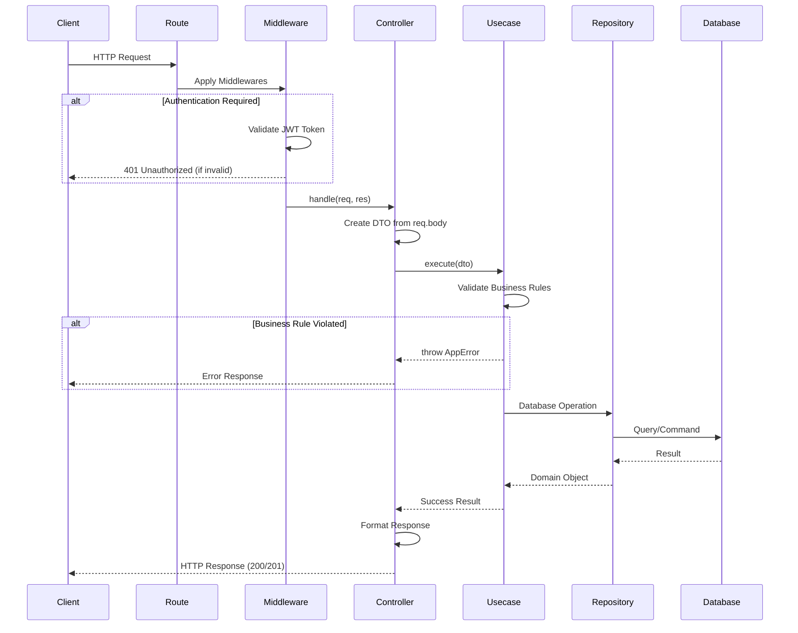

# Enéas Almeida

🇧🇷 [Português](README.md) &nbsp;|&nbsp; 🇺🇸 **English**

**Note:** About 98% of the technical artifacts (BPMN, UML, projects, diagrams and repositories) are authored by me.

## 👨‍💻 About

### Professional Experience
-   ❤️ **9+ years** of experience in modern software development
-   💼 Lead Developer at **Sicoob** - Responsible for microservices processing **R$ 6 million/month**
-   🏗️ Expert in **Microservices Architecture** and **Distributed Systems**
-   📊 Experience with large volumes of financial and sensitive data in high-pressure environments

### Academic Background
-   🎓 **Bachelor's in Computer Engineering** - Federal Institute of Paraíba (IFPB)
-   🎓 **Graduate Specialization in Distributed Software Architecture** - [PUC Minas](https://vemprapuc.pucminas.br/arquitetura-de-software-distribuido-2013?variant_id=37515)
-   🎓 **MBA in Software Engineering with AI** - [Full Cycle](https://ia.fullcycle.com.br/mba-ia/?utm_source=site-fullcycle&utm_medium=slider-site&utm_content=org_slider_mba_engenharia_ia) *(In progress)*
-   📜 **Go Expert** - [Full Cycle](https://goexpert.fullcycle.com.br/curso/) *(Completed)*
-   📜 **Java Microservices Specialist** - [AlgaWorks](https://lp.algaworks.com/curso-especialista-microsservicos-java-spring-cadastro/) *(In progress)*

### Personal

-   ✝️ Professing faith in **Jesus Christ** (my only Lord and Savior);
-   🍖 BBQ fan — having one? Call me! 🔥

## Latest Project (in progress) 🔥🔥🔥

👉 <a href="https://github.com/eneas-almeida/bridge">Bridge</a>

<a href="https://github.com/eneas-almeida/bridge"></a>

The **Bridge** project is a microservices architecture developed by Enéas Almeida, composed of two main services that communicate via **gRPC**:

- **API Service**: REST Gateway that exposes HTTP endpoints and communicates with the People service via gRPC
- **People Service**: Backend service that provides user data via gRPC, consuming an external User data API

```
┌──────────────┐     HTTP/REST      ┌──────────────┐      gRPC       ┌──────────────┐     HTTP
│    Client    │ ─────────────────> │  API Service │ ──────────────> │People Service│ ──────────> User data
│  (Browser)   │                    │  (Port 8081) │                 │ (Port 9090)  │             (External API)
└──────────────┘                    └──────────────┘                 └──────────────┘
```


# Main Technologies and Tech Stack

### Backend
-   ☕ **Java (8, 11, 17, 21)** - JBoss, Spring Boot, WebFlux, high-performance microservices
-   ⚡ **Node.js / NestJS / TypeScript** - REST API development, microservices and scalable applications
-   🔷 **Go (Golang)** - High-concurrency APIs, gRPC, distributed systems
-   🐍 **Python** - Scripts, automation and data processing

### Frontend
-   ⚛️ **React** - Modern and responsive UI development
-   💚 **Vue.js 2 & 3** (Specialist) - Vuetify, PrimeVue, Quasar, Composition API, Pinia
-   🅰️ **Angular** - Enterprise applications

### Architecture & Patterns
-   🏛️ Clean Architecture, CQRS, MVC, DDD, Event-Driven Architecture
-   🔄 Microservices, BFF (Backend for Frontend), GraphQL, gRPC
-   📐 **BPMN** and **UML** documentation specialist

### DevOps & Cloud
-   ☁️ **AWS**: S3, Redis, DocumentDB, Cognito, SQS, API Gateway, Lambda
-   🐳 **Docker**, **Kubernetes**, **Istio**, **Helm**, **Terraform**
-   🔄 CI/CD, GitHub Actions, Automated Pipelines

### Databases & Messaging
-   💾 Oracle, PostgreSQL, MySQL, MongoDB, Redis
-   📬 RabbitMQ, Apache Kafka, AWS SQS
-   🔧 TypeORM, Prisma, Mongoose

# Most Relevant Professional Experience: Sicoob

**Business Domain**

Transfer of points from the Sicoob card to partner programs.

```
                                                      ┌────────────────┐
                                              ┌──────>│    TudoAzul    │
                                              │       └────────────────┘
                                              │
                                              │       ┌────────────────┐
                            ┌─────────────────┴──┐    │     Livelo     │
                            │   Sicoob Card      │───>└────────────────┘
                            │      (Points)      │
                            └─────────────────┬──┘    ┌────────────────┐
                                              │       │     Smiles     │
                                              ├──────>└────────────────┘
                                              │
                                              │       ┌────────────────┐
                                              └──────>│   Latam Pass   │
                                                      └────────────────┘
```

**Role**

- Lead Developer, from conception to production delivery

**Responsibilities**

- Migration and development of **4 main microservices** and **7 auxiliary services**
- Involvement from understanding business rules all the way to production delivery

**Results**

- Microservices in production generating approximately **R$ 6 million/month**

**Integrations**

- Oracle
- VTEX
- Siebel
- Salesforce
- Linkapi

# Last Developed Project: Monitoring Sensors

👉 <a href="https://github.com/eneas-almeida/ms-sensors-central">Monitoring Sensors</a>

Architecture diagram.

<a href="https://github.com/eneas-almeida/ms-sensors-central"></a>

The system is composed of three independent microservices that work together to manage sensor devices and process temperature data in an asynchronous and scalable way:

1. **Device Manager:** Manages sensor registration and configuration
2. **Temperature Monitoring:** Collects and monitors temperature readings
3. **Temperature Processing:** Processes and persists temperature data with performance optimizations


## Favorites List Project (Magazine Luiza)

👉 <a href="https://github.com/eneas-almeida/luizalabs">Luizalabs</a>

Frontend screen developed for the project.

<p align="center">
    <a href="https://github.com/eneas-almeida/luizalabs"></a>
</p>

Application for adding products to a favorites list **(Magazine Luiza)**. Backend using Clean Architecture with Node.js.

### Main Features

✅ User account management (creation and authentication)<br />
✅ JWT authentication system<br />
✅ Product management in favorites lists<br />
✅ Integration with external product API<br />
✅ Clean and decoupled architecture<br />
✅ Comprehensive unit tests<br />
✅ Robust error handling<br />

### Request Flow

An HTTP request follows this path through the layers:




## Bekid Project

**Business Domain**

Monitoring children in the school environment through AI to combat bullying.

👉 <a href="https://github.com/eneas-almeida/bekid">Bekid</a> is an emotion mapping system using Artificial Intelligence to help combat school bullying. The application performs real-time behavioral analysis, offering dashboards for educational managers with alerts and reports. **(finished, live in production)**<br />


<p align="center">
    <a href="https://github.com/eneas-almeida/bekid"></a>
</p>

<a href="https://github.com/eneas-almeida/bekid"></a>

## Bestore Project (E-commerce)

👉 <a href="https://github.com/eneas-almeida/bestore">Bestore</a> - Complete REST API for e-commerce with product management, categories, shopping cart and order processing. Built in Java with Spring Boot and MySQL, following REST standards and development best practices. **(finished)**<br />


## Events-Nest (NestJS + CQRS + Clean Architecture)

👉 <a href="https://github.com/eneas-almeida/events-nest">Events-Nest</a>: Event-based microservice implementing advanced architectural patterns. The project demonstrates the practical application of CQRS (Command Query Responsibility Segregation), Event Sourcing and Clean Architecture with NestJS, separating commands from queries and maintaining a complete event history.<br />


## Latest Algorithms Developed and Used in Production

|                  Technology                  | Link                                                                            | What does it solve?                                                    |
| :------------------------------------------: | ------------------------------------------------------------------------------- | ---------------------------------------------------------------------- |
|      | 👉 <a href="https://github.com/eneas-almeida/cache-parallel">Cache Parallel</a> | External requests using parallelism strategy.                          |
|  | 👉 <a href="https://github.com/eneas-almeida/go-fetch">Fetch</a>                | External requests using parallelism strategy with fallback.            |
|  | 👉 <a href="https://github.com/eneas-almeida/go-upload">Upload</a>              | File upload to AWS S3 using fallback strategy.                         |
|  | 👉 <a href="https://github.com/eneas-almeida/grpc">gRPC</a>                     | gRPC implementation.                                                   |
|  | 👉 <a href="https://github.com/eneas-almeida/graphql">GraphQL</a>               | GraphQL implementation.                                                |

## Customer Clean Architecture (Architectural Guide)

The project demonstrates the complete implementation of Clean Architecture in microservices, with clear layer separation (Domain, Application, Infrastructure, Presentation) and the application of SOLID principles and DDD.

👉 <a href="https://github.com/eneas-almeida/customer-clean-architecture">Clean Architecture Guide</a> - Complete technical guide for clean architecture implementation, used for team onboarding and standardization.<br />


<p align="center">
    <a href="https://github.com/eneas-almeida/customer-clean-architecture"></a>
</p>

## gRPC (Implementation Guide)

<p align="center">
    <a href="https://github.com/eneas-almeida/grpc"></a>
</p>

👉 <a href="https://github.com/eneas-almeida/grpc">gRPC Guide</a> - Complete gRPC implementation guide with Go, including unary communication, streaming (server, client and bidirectional), interceptors, authentication and best practices for high-performance communication between microservices.<br />


## GraphQL (Implementation Guide)

<p align="center">
    <a href="https://github.com/eneas-almeida/graphql"></a>
</p>

👉 <a href="https://github.com/eneas-almeida/graphql">GraphQL Guide</a> - Complete GraphQL implementation guide with Go, including schemas, queries, mutations, resolvers, subscriptions and optimizations. Demonstrates how to create flexible and efficient APIs allowing clients to request exactly the data they need.<br />


## RabbitMQ (Messaging Guide)

<p align="center">
    <a href="https://github.com/eneas-almeida/rabbitmq"></a>
</p>

👉 <a href="https://github.com/eneas-almeida/rabbitmq">RabbitMQ Guide</a> - Complete messaging guide with RabbitMQ, including exchanges (direct, topic, fanout, headers), queues, dead letter queues, retry patterns, message acknowledgments and best practices for asynchronous communication between microservices.<br />


## Kafka (Event Streaming Guide)

<p align="center">
    <a href="https://github.com/eneas-almeida/kafka"></a>
</p>

👉 <a href="https://github.com/eneas-almeida/kafka">Kafka Guide</a> - Complete Apache Kafka guide for event streaming, including producers, consumers, consumer groups, partitions, replication, offset management and large-scale message processing strategies. Practical implementations in multiple languages.<br />


<br />
👉 <a href="https://github.com/eneas-almeida/customer-clean-architecture/blob/main/src/infra/services/queue/kafka-queue.service.ts">TypeScript service implementation with Kafka</a><br />
👉 <a href="https://github.com/eneas-almeida/kafka/tree/master/kafka-nestjs">Kafka + NestJs</a><br />
👉 <a href="https://github.com/eneas-almeida/kafka/tree/master/kafka-nodejs">Kafka + NodeJs</a><br />
👉 <a href="https://github.com/eneas-almeida/kafka/tree/master/kafka-python">Kafka + Python</a>

## BFF - Backend for Frontend (Architectural Pattern)

<p align="center">
  <a href="https://github.com/eneas-almeida/bff"></a>
</p>

👉 <a href="https://github.com/eneas-almeida/bff">BFF Guide</a> - Complete guide to the Backend for Frontend pattern, demonstrating how to create backend layers specific to each type of client (web, mobile, desktop). The BFF acts as an intermediary between the frontend and microservices, aggregating data, optimizing payloads and adapting APIs for the specific needs of each platform.<br />


<hr>

## Go Account API (Clean Architecture + MongoDB)

Account management microservice developed in Go rigorously following Clean Architecture principles. Uses Fiber Framework for high-performance HTTP, MongoDB as the database, and implements layer separation (entities, usecases, repositories, handlers) ensuring testability and maintainability.

<p align="center">
    <a href="https://github.com/eneas-almeida/go-account-api-mongodb"></a>
</p>

👉 <a href="https://github.com/eneas-almeida/go-account-api-mongodb">Project link</a><br />


<hr>

## MyPoint (Time Tracking System + High Concurrency)

**What does it solve?**

Concurrency problems and database overload. Multiple parallel and heavy queries that lead to exhaustion of processing resources.

<p align="center">
    <a href="https://github.com/eneas-almeida/mypoint"></a>
</p>

👉 <a href="https://github.com/eneas-almeida/mypoint">MyPoint</a> is an employee time tracking system built with microservices architecture. It uses queues (RabbitMQ) for asynchronous processing, distributed cache to reduce database load, and WebSocket for real-time updates. The architecture supports high volumes of simultaneous requests without performance degradation. **(in progress)**<br />


<hr>

### GoLang

<p align="center">
    <a href="https://github.com/eneas-almeida/golang"></a>
</p>

👉 <a href="https://github.com/eneas-almeida/golang">Installation, configuration and plugins</a><br />
👉 <a href="https://github.com/eneas-almeida/go-routines/">Go routines (the efficient workers case)</a><br />
👉 <a href="https://github.com/eneas-almeida/go/tree/main/projects/go-http-retry-backoff">Go http retry with exponential backoff</a><br />
👉 <a href="https://github.com/eneas-almeida/go/tree/main/projects/go-algorithms">Go algorithms</a><br />
👉 <a href="https://github.com/eneas-almeida/go/tree/main/projects/go-injections">Go injections</a><br />
👉 <a href="https://github.com/eneas-almeida/go/tree/main/projects/go-injections-with-google-wire">Go injections with Google Wire</a><br />
👉 <a href="https://github.com/eneas-almeida/go/tree/main/projects/go-viacep">Go API ViaCEP</a><br />
👉 <a href="https://github.com/eneas-almeida/go/tree/main/projects/go-encoder">Go encoder</a> <br />
👉 <a href="https://github.com/eneas-almeida/go/tree/main/projects/go-database">Go database</a> <br />
👉 <a href="https://github.com/eneas-almeida/go/tree/main/projects/go-clean-architecture-basic">Go clean architecture</a> <br />
👉 <a href="https://github.com/eneas-almeida/go/tree/main/projects/go-deploy">Go deploy</a> <br />
👉 <a href="https://github.com/eneas-almeida/go/tree/main/projects/go-validations">Go validations</a> <br />
👉 <a href="https://github.com/eneas-almeida/go/tree/main/projects/go-configs-dot-env">Go env</a> <br />
👉 <a href="https://github.com/eneas-almeida/concorrencia-go">Go concurrency</a> (Third-party repository)

### Nodejs

👉 <a href="https://github.com/eneas-almeida/nodejs-http-retry/tree/main">HTTP call resilience with Axios Retry</a><br />
👉 <a href="https://github.com/eneas-almeida/nodejs-base">NodeJs Base API</a>

### K8s

👉 <a href="https://github.com/eneas-almeida/k8s">K8s</a><br />
👉 <a href="https://github.com/eneas-almeida/istio">Istio</a>

### VueJs 3

👉 <a href="https://github.com/eneas-almeida/vue3-with-casl">VueJs v3 + Pinia + ACLs Casl</a> **(finished)**<br />
👉 <a href="https://github.com/eneas-almeida/vue3-composition-api">VueJs v3 + Composition api + props + emit + watch</a> **(finished)**

<hr>

### Socket.io (Real-time Communication)

👉 <a href="https://github.com/eneas-almeida/socketio_vuejs_nodejs">Socket.io with Vue/Node/Nest</a> - Bidirectional real-time communication system using WebSockets. Implements JWT authentication, Observer pattern for events, rooms/namespaces and automatic reconnection. Frontend in Vue.js and backend in Node.js/NestJS. ❤️ **(finished)**<br />


### NestJs Architecture (Rich Domains + DDD)

👉 <a href="https://github.com/eneas-almeida/nestjs/tree/master/nestjs-value-object">NestJs + Rich Domains</a> - REST API implementing **Domain-Driven Design** with rich domain modeling. Uses **Value Objects** to encapsulate business rules, **Either Pattern** for functional error handling, **DTOs** for input/output validation and **Mappers** for layer transformation, ensuring separation of concerns and a framework-free domain.<br />


<hr>

## More Developed APIs

### School Dropout (Educational Analysis System)

👉 <a href="https://github.com/eneas-almeida/api-evasao-escolar-nestjs">School Dropout</a> - System for analyzing and preventing school dropout in public higher education institutions. Collects and processes academic data to identify patterns and at-risk students, generating reports and dashboards for educational managers. **(finished, live in production)**<br />


---

### Tindin (Class Management)

👉 <a href="https://github.com/eneas-almeida/api-tindin">Tindin</a> - API for controlling and managing classes taught by teachers. Complete system with authentication, class CRUD, reports and statistics. Developed with TDD and high test coverage. **(finished)**<br />


---

### Places to Know (Tourist Spots API)

👉 <a href="https://github.com/eneas-almeida/api-places-to-know">Places to Know</a> - API for cataloging tourist spots around the world with integration to external geolocation APIs. Implements advanced search system with multiple filters, pagination and result caching. **(finished)**<br />


## Previous Work

### Oráculo (Financial System)

👉 <a href="https://github.com/eneas-almeida/oraculo">Oráculo</a> - Complete financial management system for a client company. Interface developed with HTML5, vanilla JavaScript and jQuery, implementing income, expense, cash flow and management report controls. **(finished)**<br />


<p align="center">
  <a href="https://github.com/eneas-almeida/oraculo"></a>
</p>

---

### Gerente RH (Human Resources System)

👉 <a href="https://github.com/eneas-almeida/gerente-rh">Gerente RH</a> - Desktop employee management system with registration control, payroll, vacations and benefits. Developed in MVC architecture with C# and Microsoft SQL Server. **(finished)**<br />


<p align="center">
  <a href="https://github.com/eneas-almeida/gerente-rh"></a>
</p>

## Javascript (Last 5 algorithms developed)

👉 <a href="https://github.com/eneas-almeida/javascript/blob/master/codes/readfileTxtAndConvertValuesToXlsx.js">Read Txt and convert to Xlsx</a> - Reads a .txt file, retrieves values, generates the .xlsx file, inserts the values read from the txt and formats them as currency R$. **(finished)**<br />

👉 <a href="https://github.com/eneas-almeida/javascript/blob/master/codes/getLevel.js">Get Level</a> - Eliminates the use of multiple IF and ELSE blocks for value range intervals. **(finished)**<br />

👉 <a href="https://github.com/eneas-almeida/javascript/blob/master/codes/parseDTO.js">Parse DTO</a> - Transforms object properties from Camel Case to Snake Case. **(finished)**<br />

👉 <a href="https://github.com/eneas-almeida/javascript/blob/master/codes/fIlterPropertiesInArrayObjects.js">Filter Properties</a> - Filters object properties by passing an array indicating which properties to remove. **(finished)**<br />

👉 <a href="https://github.com/eneas-almeida/javascript/blob/master/codes/mapEnumObjects.js">MAP Enum</a> - Technique I use to eliminate large quantities of IFs in the system. **(finished)**<br />

👉 <a href="https://github.com/eneas-almeida/javascript/tree/master/codes">All scripts</a> **(in progress)**<br />

## Node.js Testing Studies

👉 <a href="https://github.com/eneas-almeida/javascript/tree/master/codes/tests/mocks">Mock tests</a> - Studies on unit tests using mocks and Node.js native libraries. **(finished)**<br />

👉 <a href="https://github.com/eneas-almeida/javascript/tree/master/codes/tests/stubs">Stub with mocks</a> - Tests using the stub technique to simulate an API request. **(finished)**<br />

## Case Studies

### Auth NestJS (Complete Authentication)

👉 <a href="https://github.com/eneas-almeida/auth-nest">API Rest SigIn/SigUp</a> - Complete authentication and authorization system implementing JWT, refresh tokens, guards, custom interceptors, structured logger and unit tests. **(finished)**<br />


---

### NestJS + Prisma (Complete API)

👉 <a href="https://github.com/eneas-almeida/nestjs-with-prisma">API Rest NestJs with Prisma</a> - Modern REST API with Prisma ORM, Swagger/OpenAPI documentation, data validation with class-validator, transformers, custom pagination, global exception handling and logger. Includes Docker Compose for development environment. **(finished)**<br />


---

### VacinaPB (TDD + Clean Architecture)

👉 <a href="https://github.com/eneas-almeida/vacina_pb">VacinaPB</a> - Case study rigorously applying **Test-Driven Development (TDD)**. Implements Clean Architecture, design patterns (Repository, Factory, Strategy), rich domain modeling with Value Objects and Entity, based on Martin Fowler's teachings on refactoring and architecture. **(finished)**<br />


---

### Entity Modeling (Either Pattern)

👉 <a href="https://github.com/eneas-almeida/modelagem_entidade">Entity modeling (Tiny)</a> - Implementation of the **Either Pattern** in Java for functional error handling. The technique uses an Either.java class to encapsulate success or failure, allowing elegant exception management without try-catch, inspired by functional programming. **(finished)**<br />


---

### Performance Testing (JMeter)

👉 <a href="https://github.com/eneas-almeida/teste_exaustao">Exhaustion Test (JMeter)</a> - Load and stress testing using Apache JMeter for performance analysis, bottleneck identification and application capacity limits. **(finished)**<br />


---

### CI/CD (Codeship)

👉 <a href="https://github.com/eneas-almeida/deploy_codeship">Deploy to QA and Production</a> - Continuous integration and automated deployment pipeline using Codeship, with separate QA and Production environments, automated tests and conditional deployment. **(finished)**<br />


---

### Automated Releases

👉 <a href="https://github.com/eneas-almeida/create_releases">Create releases</a> - Automation of GitHub release creation with semantic versioning, automatic changelog and tagging. **(finished)**<br />


---

### Other Studies

👉 <a href="https://github.com/eneas-almeida/nodejs-prisma">API Rest NodeJs with Prisma</a> - Package by Feature architecture with Prisma and Jest tests. **(finished)**<br />

👉 <a href="https://github.com/eneas-almeida/series-tv-backend">TV Series</a> - Fullstack with Spring Boot + Angular 12. **(finished)**<br />

👉 <a href="https://github.com/eneas-almeida/grisoli">Grisoli</a> - Microservices with NodeJs, Spring Boot, RabbitMQ and GitHub Actions. **(aborted)**<br />

👉 <a href="https://github.com/eneas-almeida/mongo_spring">API Rest Spring Boot with MongoDB</a> - Spring Boot + MongoDB. **(finished)**<br />

👉 <a href="https://github.com/eneas-almeida/agenda_contatos">Contact Book</a> - Java Servlets. **(finished)**<br />

## VueJs

👉 <a href="https://github.com/eneas-almeida/vuejs_tests">VueJs Tests</a> - Study on testing with jest and vuetify. **(finished)**<br />

👉 <a href="https://github.com/eneas-almeida/vuejs_upload_xsl">VueJs Upload XSL</a> - Study on uploading .xsl files with vuetify. 🔒 (private) **(finished)**<br />

👉 <a href="https://github.com/eneas-almeida/vuejs_checkbox">VueJs Checkbox</a> - Checkbox select with vuetify. **(finished)**<br />

👉 <a href="https://github.com/eneas-almeida/vuejs_select_all">VueJs Select All</a> - Select all with vuetify. **(finished)**<br />

👉 <a href="https://github.com/eneas-almeida/vuejs_vuetify">VueJs Vuetify</a> - Study on vuetify. 🔒 (private) **(finished)**<br />

👉 <a href="https://github.com/eneas-almeida/vuejs_geral">VueJs General</a> - General studies. **(finished)**<br />

👉 <a href="https://github.com/eneas-almeida/vuejs_object_change">VueJs Object Change</a> - Studies on modifying, deleting properties and making object copies. **(finished)**<br />

👉 <a href="https://github.com/eneas-almeida/vuejs_computed">VueJs Computed</a> - Study on computed with a v-for directive, filtering by object status. **(finished)**<br />

👉 <a href="https://github.com/eneas-almeida/vuejs_form">VueJs Form</a> - Study on forms. **(finished)**<br />

👉 <a href="https://github.com/eneas-almeida/vuejs_route">VueJs Route</a> - Study on routes. **(finished)**<br />

👉 <a href="https://github.com/eneas-almeida/vuejs_props">VueJs Props</a> - Study on props. **(finished)**<br />

👉 <a href="https://github.com/eneas-almeida/vuejs_slots">VueJs Slots</a> - Study on slots. **(finished)**<br />

👉 <a href="https://github.com/eneas-almeida/vuejs_component_dinamic">VueJs Dynamic Component</a> - Study on dynamic components. **(finished)**<br />

👉 <a href="https://github.com/eneas-almeida/vuejs_vuex">VueJs Vuex</a> - Study on shared state with vuex. **(finished)**<br />

👉 <a href="https://github.com/eneas-almeida/vuejs_vuex_v2">VueJs Vuex v2</a> - Study on shared state with vuex v2. **(finished)**<br />

👉 <a href="https://github.com/eneas-almeida/vuejs_axios">VueJs Axios</a> - Study on vuejs with axios. **(finished)**<br />

👉 <a href="https://github.com/eneas-almeida/vuejs_todo">Vuejs Todo + Localstorage</a> - Case study of a task todo list. **(finished)**<br />

👉 <a href="https://github.com/eneas-almeida/vuejs_burguer">Vuejs Burger</a> - Case study of a burger sales app. **(finished)**<br />

👉 <a href="https://github.com/eneas-almeida/vuejs_props_by_copy">Vuejs Refs By Copy</a> - Study on passing by copy and by reference. **(finished)**<br />

👉 <a href="https://github.com/eneas-almeida/vuejs_css">Vuejs CSS</a> - Study on CSS. **(finished)**<br />

👉 <a href="https://github.com/eneas-almeida/vuejs_filters">Vuejs Filters</a> - Study on filters. **(finished)**<br />

👉 <a href="https://github.com/eneas-almeida/vuejs_mixins">Vuejs Mixins</a> - Study on mixins. **(finished)**<br />

## Academic

| Photo                                           | Description                                                                                                                                                                                                      |
| ----------------------------------------------- | ---------------------------------------------------------------------------------------------------------------------------------------------------------------------------------------------------------------- |
|  | 👉 <a href="https://github.com/eneas-almeida/sistemas-embarcados">Embedded Systems</a> - Final project for the Embedded Systems course in Computer Engineering, IFPB. **(finished)**<br />                       |
|    | 👉 <a href="https://github.com/eneas-almeida/shield_dados">Prototyping</a> - Final project for the Prototyping course in Computer Engineering, IFPB. **(finished)**<br />                                        |

<hr>

### My Mentors and Teachers

The authors listed below are reference sources in my study and work journey — for most of them, I participated in courses that served as a foundation to deepen my knowledge.

-   Tiago Matos **(VueJs 3, Composition API, Pinia)**
-   João Rangel **(NestJs)**
-   Diego Fernandes **(NestJs, Microservices and RabbitMQ)**
-   Stephany Henrique **(GoLang)**
-   Otávio Augusto Gallego **(GoLang)**
-   Ellen körbes **(GoLang)**
-   Fernando Daciuk **(Javascript and advanced Git)**
-   Fernando Amaral **(Kafka)**
-   Wesley Willians **(Kafka, GoLang)**
-   Loiane Groner **(Angular)**
-   Leonardo Moura **(VueJs, Docker, Typescript and GraphQL)**
-   Matheus Battisti **(Docker, Kubernetes and VueJs)**
-   Nélio Alves **(Spring Boot)**
-   AlgaWorks **(Spring Boot and Angular)**
-   Otávio Lemos **(Architecture and TDD with Typescript)**
-   Ruan Delgado **(Algorithms and study tips)**
-   Fábio Akita **(Pragmatic study tips)**
-   Rocketseat **(NodeJs backend stack)**
-   Henrique Cunha **(Algorithms)**
-   César Vasconcelos **(Java)**
-   Otávio Miranda **(Design patterns with Typescript)**
-   Erick Wendel **(Advanced NodeJs)**
-   Linux Tips **(Linux, Docker and Kubernetes)**
-   Dev Soltinho **(Javascript, Git)**
-   Claudson Oliveira **(Working abroad, GoLang)**
-   Rodrigo Branas **(Javascript)**
-   Jonathan Baraldi **(DevOps with Rancher, AWS and GCP)**
-   Codar.me **(NodeJs)**
-   Plínio Naves **(VueJs & Vuetify)**
-   Victor Hugo Negrisoli **(Microservices)**

<hr>

© Document authored by <a href="https://github.com/eneas-almeida">Edivam Enéas de Almeida Júnior</a>.
