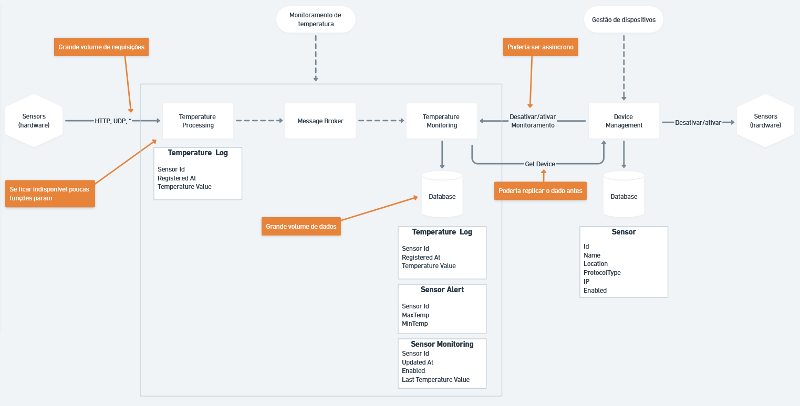
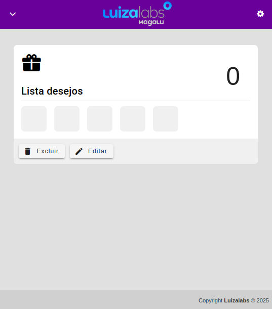
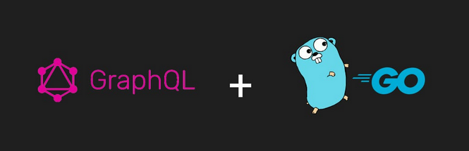

# Enéas Almeida

**Observação:** 98% dos fluxos de BPMN, UML, desenhos técnicos e repositórios são de autoria própria.

## 👨‍💻 Sobre

### Experiência Profissional
-   ❤️ **9+ anos** de experiência em desenvolvimento de software moderno
-   💼 Desenvolvedor Principal no **Sicoob** - Responsável por microserviços que processam **R$ 6 milhões/mês**
-   🏗️ Especialista em **Arquitetura de Microserviços** e **Sistemas Distribuídos**
-   📊 Experiência com grandes volumes de dados financeiros em ambientes de alta pressão
-   🎯 Foco em **Clean Architecture**, **SOLID** e **Design Patterns**

### Formação Acadêmica
-   🎓 **Bacharel em Engenharia de Computação** - Instituto Federal da Paraíba
-   🎓 **Pós-graduação em Arquitetura de Software Distribuído** - [PUC Minas](https://vemprapuc.pucminas.br/arquitetura-de-software-distribuido-2013?variant_id=37515)
-   🎓 **MBA em Engenharia de Software com IA** - [Full Cycle](https://ia.fullcycle.com.br/mba-ia/?utm_source=site-fullcycle&utm_medium=slider-site&utm_content=org_slider_mba_engenharia_ia) *(Em andamento)*
-   📜 **Go Expert** - [Full Cycle](https://goexpert.fullcycle.com.br/curso/) *(Concluído)*
-   📜 **Especialista em Microserviços com Java** - [AlgaWorks](https://lp.algaworks.com/curso-especialista-microsservicos-java-spring-cadastro/) *(Em andamento)*

### Pessoal

-   ✝️ Professante da fé em **Jesus Cristo** (meu único Senhor e Salvador);
-   🍖 Fã de churrasco, fez um? me chama! 🔥

## Projeto Recente (em andamento) 🔥🔥🔥

👉 <a href="https://github.com/eneas-almeida/bridge">Bridge</a>

<a href="https://github.com/eneas-almeida/bridge"></a>

O projeto **Bridge** é uma arquitetura de microserviços desenvolvida por Enéas Almeida, composta por dois serviços principais que se comunicam via **gRPC**:

- **API Service**: Gateway REST que expõe endpoints HTTP e se comunica com o serviço People via gRPC
- **People Service**: Serviço backend que fornece dados de usuários via gRPC, consumindo a API externa de dados de Usuários

```
┌──────────────┐     HTTP/REST      ┌──────────────┐      gRPC       ┌──────────────┐     HTTP
│   Cliente    │ ─────────────────> │  API Service │ ──────────────> │People Service│ ──────────> Dados de usuários
│  (Browser)   │                    │  (Port 8081) │                 │ (Port 9090)  │             (External API)
└──────────────┘                    └──────────────┘                 └──────────────┘
```


## Stack Tecnológica

**Backend (Fullstack)**
-   ⚡ **Node.js / NestJS / TypeScript** - Desenvolvimento de APIs REST, microserviços e aplicações escaláveis
-   ☕ **Java (8, 11, 17, 21)** - JBoss, Spring Boot, WebFlux, microserviços de alta performance
-   🔷 **Go (Golang)** - APIs de alta concorrência, gRPC, sistemas distribuídos
-   🐍 **Python** - Scripts, automação e processamento de dados

**Frontend (Especialista Vue.js)**
-   💚 **Vue.js 2 & 3** (Especialista) - Vuetify, PrimeVue, Quasar, Composition API, Pinia
-   ⚛️ **React** - Desenvolvimento de interfaces modernas e responsivas
-   🅰️ **Angular** - Aplicações enterprise

**Arquitetura & Padrões**
-   🏛️ Clean Architecture, CQRS, MVC, DDD, Event-Driven Architecture
-   🔄 Microserviços, BFF (Backend for Frontend), GraphQL, gRPC
-   📐 Especialista em documentações **BPMN** e **UML**

**DevOps & Cloud**
-   ☁️ **AWS**: S3, Redis, DocumentDB, Cognito, SQS, API Gateway, Lambda
-   🐳 **Docker**, **Kubernetes**, **Istio**, **Helm**, **Terraform**
-   🔄 CI/CD, GitHub Actions, Pipelines automatizados

**Banco de Dados & Mensageria**
-   💾 Oracle, PostgreSQL, MySQL, MongoDB, Redis
-   📬 RabbitMQ, Apache Kafka, AWS SQS
-   🔧 TypeORM, Prisma, Mongoose

## Atuação mais significativa: SICOOB

**Papel**
- Desenvolvedor principal

**Responsabilidades**
- Migração e desenvolvimento de **4 microserviços principais** e **7 auxiliares**
- Atuação do entendimento das regras de negócio até a entrega em produção

**Resultados**
- Microserviços em produção gerando cerca de **R$ 6 milhões/mês**

**Domínio de Negócio**
- Transferência de pontos do cartão Sicoob para:
  - Livelo
  - Decolar
  - Smiles
  - Azul
  - Latam

**Integrações**
- Web services corporativos:
  - Oracle
  - VTEX
  - Siebel
  - Salesforce

**Fluxo de exemplo**

O fluxo abaixo foi desenvolvido por Enéas Almeida no âmbito de trabalho, dados foram omitidos para não comprometer a segurança da aplicação.


<details>
<summary>+ Sobre</summary>

-   Atuação em ambientes com adoção de metodologias ágeis;
-   Atuação em ambientes de pressão com grande volume de dados financeiros;
-   Banco de dados relacional e NoSql;
-   Experiência em desenvolvimento em arquitetura de microsserviços;
-   Experiência em API Manager (Linkapi);
-   Experiência na criação de componentes reutilizáveis;
-   Experiência na utilização de conceitos DDD;
-   SOLID / Clean Architecture;
-   Git / Gitflow / Conventional Commit;
-   UML;
-   BPMN;
-   Docker;
-   Sonarlint;
-   Sentry;
-   Documentação de APIs;
-   Compreensão de CI/CD;
-   Jira / Bitrix24 / GitLab.
</details>

<details>
<summary>Técnicas de desenvolvimento utilizadas</summary>

-   Fail first;
-   Padronização de commits (conventional commits);
-   Versionamento de módulos para facilitação de refatorações;
-   Modelagem de entidades ricas com tratamento de exceções (Either) (DDD);
-   Desenvolvimento guiado a interfaces;
-   Chaveamento nas injeções de dependências utilizando o padrão strategy;
-   Persistência dos dados em memória para facilitação dos testes unitários;
-   Tratamento de exceções personalizados;
-   Utilizações dos padrões Adapter, Build, Strategy, Barrels, Dto, Factory;
-   Utilização dos pipes validations para validação de dados nos DTOs;
-   Camada de repositórios com ORM TypeORM;
-   Versionamento do banco de dados, através das migrations;
-   Criação dos index nas colunas através das migrations;
-   Mappers para realizar as conversões de dados;
-   Variáveis de ambiente;
-   Interceptadores para criação dos logs da aplicação;
-   Decorators personalizados;
-   Testes unitários com o Jest, guiado pelo coverage reports;
-   Utilização de bibliotecas para transpilar o código mais rapidamente;
-   Rate Limit;
-   Swagger;
-   Socket.io;
-   Criação de caches;
-   Interceptação de erros com o sentry;
-   Utilização das bibliotecas: bull, tsryng, ioredis, supertest, mongodb, sentry, moment;
-   Técnica de expurgo.
</details>

## Sensors (Microserviços + RabbitMQ)

👉 <a href="https://github.com/eneas-almeida/ms-sensors-central">Sensor</a>: Desenvolvimento de backend com Java, arquitetura de microserviços e comunicação assíncrona via RabbitMQ. O projeto iniciou com a modelagem de um sistema monolítico, que posteriormente foi refatorado em microserviços, incorporando o uso de um message broker para orquestração e troca de mensagens.<br />


<a href="https://github.com/eneas-almeida/ms-sensors-central"></a>

## Events-Nest (NestJS + CQRS + Clean Architecture)

👉 <a href="https://github.com/eneas-almeida/events-nest">Events-Nest</a>: Microserviço baseado em eventos implementando padrões avançados de arquitetura. O projeto demonstra a aplicação prática de CQRS (Command Query Responsibility Segregation), Event Sourcing e Clean Architecture com NestJS, separando comandos de consultas e mantendo um histórico completo de eventos.<br />


## Luizalabs

👉 <a href="https://github.com/eneas-almeida/luizalabs">Luizalabs</a>: backend em NodeJs utilizando clean architecture e frontend utilizando VueJs.<br />


<p align="center">
    <a href="https://github.com/eneas-almeida/luizalabs"></a>
</p>

## Últimos algoritimos desenvolvidos e utilizados em produção

|                  Tecnologia                  | Link                                                                            | O que resolve?                                                         |
| :------------------------------------------: | ------------------------------------------------------------------------------- | ---------------------------------------------------------------------- |
|      | 👉 <a href="https://github.com/eneas-almeida/cache-parallel">Cache Parallel</a> | Requisições externas utilizando estratégia de paralelismo.             |
|  | 👉 <a href="https://github.com/eneas-almeida/go-fetch">Fetch</a>                | Requisição externas utilizando estratégia de paralelismo com fallback. |
|  | 👉 <a href="https://github.com/eneas-almeida/go-upload">Upload</a>              | Upload de arquivos na AWS S3, utilizando estratégia de fallback.       |
|  | 👉 <a href="https://github.com/eneas-almeida/grpc">gRPC</a>                     | Implementação gRPC.                                                    |
|  | 👉 <a href="https://github.com/eneas-almeida/graphql">GraphQL</a>               | Implementação GraphQL.                                                 |

## Bekid (IA + Monitoramento Escolar)

**O que resolve?**

Monitoramento da criança no ambiente escolar através de IA para combate ao bullying.

👉 <a href="https://github.com/eneas-almeida/bekid">Bekid</a> é um sistema de mapeamento de emoções utilizando Inteligência Artificial para auxílio no combate ao bullying escolar. A aplicação realiza análise comportamental em tempo real, oferecendo dashboards para gestores educacionais com alertas e relatórios. **(finalizado, online em produção)**<br />


<p align="center">
    <a href="https://github.com/eneas-almeida/bekid"></a>
</p>

<a href="https://github.com/eneas-almeida/bekid"></a>

## Bestore (E-commerce API)

👉 <a href="https://github.com/eneas-almeida/bestore">Bestore</a> - API REST completa para e-commerce com gerenciamento de produtos, categorias, carrinho de compras e processamento de pedidos. Desenvolvida em Java com Spring Boot e MySQL, seguindo padrões REST e boas práticas de desenvolvimento. **(finalizado)**<br />


## Customer Clean Architecture (Guia Arquitetural)

O projeto demonstra a implementação completa de Clean Architecture em microserviços, com separação clara de camadas (Domain, Application, Infrastructure, Presentation) e aplicação de princípios SOLID e DDD.

👉 <a href="https://github.com/eneas-almeida/customer-clean-architecture">Guia Clean Architecture</a> - Guia técnico completo para implementação de arquitetura limpa, utilizado para onboarding e padronização de equipe.<br />


<p align="center">
    <a href="https://github.com/eneas-almeida/customer-clean-architecture"></a>
</p>

## gRPC (Guia de Implementação)

<p align="center">
    <a href="https://github.com/eneas-almeida/grpc"></a>
</p>

👉 <a href="https://github.com/eneas-almeida/grpc">Guia gRPC</a> - Guia completo de implementação de gRPC com Go, incluindo comunicação unária, streaming (server, client e bidirecional), interceptors, autenticação e melhores práticas para comunicação de alta performance entre microserviços.<br />


## GraphQL (Guia de Implementação)

<p align="center">
    <a href="https://github.com/eneas-almeida/graphql"></a>
</p>

👉 <a href="https://github.com/eneas-almeida/graphql">Guia GraphQL</a> - Guia completo de implementação de GraphQL com Go, incluindo schemas, queries, mutations, resolvers, subscriptions e otimizações. Demonstra como criar APIs flexíveis e eficientes permitindo que clientes solicitem exatamente os dados necessários.<br />


## RabbitMQ (Guia de Mensageria)

<p align="center">
    <a href="https://github.com/eneas-almeida/rabbitmq"></a>
</p>

👉 <a href="https://github.com/eneas-almeida/rabbitmq">Guia RabbitMQ</a> - Guia completo de mensageria com RabbitMQ, incluindo exchanges (direct, topic, fanout, headers), filas, dead letter queues, padrões de retry, confirmações de mensagens e melhores práticas para comunicação assíncrona entre microserviços.<br />


## Kafka (Guia de Event Streaming)

<p align="center">
    <a href="https://github.com/eneas-almeida/kafka"></a>
</p>

👉 <a href="https://github.com/eneas-almeida/kafka">Guia Kafka</a> - Guia completo de Apache Kafka para event streaming, incluindo producers, consumers, consumer groups, partições, replicação, offset management e estratégias de processamento de mensagens em larga escala. Implementações práticas em múltiplas linguagens.<br />


<br />
👉 <a href="https://github.com/eneas-almeida/customer-clean-architecture/blob/main/src/infra/services/queue/kafka-queue.service.ts">Implementação de um serviço em Typescript com Kafka</a><br />
👉 <a href="https://github.com/eneas-almeida/kafka/tree/master/kafka-nestjs">Kafka + NestJs</a><br />
👉 <a href="https://github.com/eneas-almeida/kafka/tree/master/kafka-nodejs">Kafka + NodeJs</a><br />
👉 <a href="https://github.com/eneas-almeida/kafka/tree/master/kafka-python">Kafka + Python</a>

## BFF - Backend for Frontend (Padrão Arquitetural)

<p align="center">
  <a href="https://github.com/eneas-almeida/bff"></a>
</p>

👉 <a href="https://github.com/eneas-almeida/bff">Guia BFF</a> - Guia completo do padrão Backend for Frontend, demonstrando como criar camadas de backend específicas para cada tipo de cliente (web, mobile, desktop). O BFF atua como intermediário entre o frontend e os microserviços, agregando dados, otimizando payload e adaptando APIs para necessidades específicas de cada plataforma.<br />


<hr>

## Go Account API (Clean Architecture + MongoDB)

Microserviço de gerenciamento de contas desenvolvido em Go seguindo rigorosamente os princípios de Clean Architecture. Utiliza Fiber Framework para alta performance HTTP, MongoDB como banco de dados, e implementa separação de camadas (entities, usecases, repositories, handlers) garantindo testabilidade e manutenibilidade.

<p align="center">
    <a href="https://github.com/eneas-almeida/go-account-api-mongodb"></a>
</p>

👉 <a href="https://github.com/eneas-almeida/go-account-api-mongodb">Link do projeto</a><br />


<hr>

## MyPoint (Sistema de Ponto + Alta Concorrência)

**O que resolve?**

Problemas de concorrência e sobrecarga de banco de dados. Múltiplas consultas paralelas e densas que levam à exaustão dos recursos de processamento.

<p align="center">
    <a href="https://github.com/eneas-almeida/mypoint"></a>
</p>

👉 <a href="https://github.com/eneas-almeida/mypoint">MyPoint</a> é um sistema para registro de ponto eletrônico de funcionários construído com arquitetura de microserviços. Utiliza filas (RabbitMQ) para processamento assíncrono, cache distribuído para redução de carga no banco, e WebSocket para atualizações em tempo real. A arquitetura suporta alto volume de requisições simultâneas sem degradação de performance. **(em andamento)**<br />


<hr>

### GoLang

<p align="center">
    <a href="https://github.com/eneas-almeida/golang"></a>
</p>

👉 <a href="https://github.com/eneas-almeida/golang">Instalação, configuração e plugins</a><br />
👉 <a href="https://github.com/eneas-almeida/go-routines/">Go routines (caso dos trabalhadores eficiêntes)</a><br />
👉 <a href="https://github.com/eneas-almeida/go/tree/main/projects/go-http-retry-backoff">Go http retry with exponential backoff</a><br />
👉 <a href="https://github.com/eneas-almeida/go/tree/main/projects/go-algorithms">Go algoritmos</a><br />
👉 <a href="https://github.com/eneas-almeida/go/tree/main/projects/go-injections">Go injections</a><br />
👉 <a href="https://github.com/eneas-almeida/go/tree/main/projects/go-injections-with-google-wire">Go injections com Google Wire</a><br />
👉 <a href="https://github.com/eneas-almeida/go/tree/main/projects/go-viacep">Go API ViaCEP</a><br />
👉 <a href="https://github.com/eneas-almeida/go/tree/main/projects/go-encoder">Go encoder</a> <br />
👉 <a href="https://github.com/eneas-almeida/go/tree/main/projects/go-database">Go database</a> <br />
👉 <a href="https://github.com/eneas-almeida/go/tree/main/projects/go-clean-architecture-basic">Go clean architecture</a> <br />
👉 <a href="https://github.com/eneas-almeida/go/tree/main/projects/go-deploy">Go deploy</a> <br />
👉 <a href="https://github.com/eneas-almeida/go/tree/main/projects/go-validations">Go validations</a> <br />
👉 <a href="https://github.com/eneas-almeida/go/tree/main/projects/go-configs-dot-env">Go env</a> <br />
👉 <a href="https://github.com/eneas-almeida/concorrencia-go">Go concorrência</a> (Repositório de terceiro)

### Nodejs

👉 <a href="https://github.com/eneas-almeida/nodejs-http-retry/tree/main">Resiliência de chamadas HTTP com Axios Retry</a><br />
👉 <a href="https://github.com/eneas-almeida/nodejs-base">NodeJs Base API</a>

### K8s

👉 <a href="https://github.com/eneas-almeida/k8s">K8s</a><br />
👉 <a href="https://github.com/eneas-almeida/istio">Istio</a>

### VueJs 3

👉 <a href="https://github.com/eneas-almeida/vue3-with-casl">VueJs v3 + Pinia + ACLs Casl</a> **(finalizado)**<br />
👉 <a href="https://github.com/eneas-almeida/vue3-composition-api">VueJs v3 + Composition api + props + emit + watch</a> **(finalizado)**

<hr>

### Socket.io (Comunicação Real-time)

👉 <a href="https://github.com/eneas-almeida/socketio_vuejs_nodejs">Socket.io com Vue/Node/Nest</a> - Sistema de comunicação bidirecional em tempo real utilizando WebSockets. Implementa autenticação via JWT, padrão Observer para eventos, rooms/namespaces e reconexão automática. Frontend em Vue.js e backend em Node.js/NestJS. ❤️ **(finalizado)**<br />


### Arquitetura com NestJs (Domínios Ricos + DDD)

👉 <a href="https://github.com/eneas-almeida/nestjs/tree/master/nestjs-value-object">NestJs + Domínios Ricos</a> - API REST implementando **Domain-Driven Design** com modelagem de domínios ricos. Utiliza **Value Objects** para encapsular regras de negócio, **Either Pattern** para tratamento funcional de erros, **DTOs** para validação de entrada/saída e **Mappers** para transformação entre camadas, garantindo separação de responsabilidades e domínio livre de frameworks.<br />


<hr>

## Mais APIs desenvolvidas

### Evasão Escolar (Sistema de Análise Educacional)

👉 <a href="https://github.com/eneas-almeida/api-evasao-escolar-nestjs">Evasão Escolar</a> - Sistema para análise e prevenção da evasão escolar em instituições públicas de nível superior. Coleta e processa dados acadêmicos para identificar padrões e alunos em risco, gerando relatórios e dashboards para gestores educacionais. **(finalizado, online em produção)**<br />


---

### Tindin (Controle de Aulas)

👉 <a href="https://github.com/eneas-almeida/api-tindin">Tindin</a> - API para controle e gerenciamento de aulas ministradas por professores. Sistema completo com autenticação, CRUD de aulas, relatórios e estatísticas. Desenvolvida com TDD e alta cobertura de testes. **(finalizado)**<br />


---

### Places to Know (API de Locais Turísticos)

👉 <a href="https://github.com/eneas-almeida/api-places-to-know">Places to Know</a> - API para catalogação de locais turísticos pelo mundo com integração a APIs externas de geolocalização. Implementa sistema de busca avançada com filtros múltiplos, paginação e cache de resultados. **(finalizado)**<br />


## Trabalhos antigos

### Oráculo (Sistema Financeiro)

👉 <a href="https://github.com/eneas-almeida/oraculo">Oráculo</a> - Sistema completo de gerenciamento financeiro para empresa cliente. Interface desenvolvida com HTML5, JavaScript vanilla e jQuery, implementando controle de receitas, despesas, fluxo de caixa e relatórios gerenciais. **(finalizado)**<br />


<p align="center">
  <a href="https://github.com/eneas-almeida/oraculo"></a>
</p>

---

### Gerente RH (Sistema de Recursos Humanos)

👉 <a href="https://github.com/eneas-almeida/gerente-rh">Gerente RH</a> - Sistema desktop de gerenciamento de funcionários com controle de cadastro, folha de pagamento, férias e benefícios. Desenvolvido em arquitetura MVC com C# e Microsoft SQL Server. **(finalizado)**<br />


<p align="center">
  <a href="https://github.com/eneas-almeida/gerente-rh"></a>
</p>

## Javascript (5 últimos algoritimos desenvolvidos)

👉 <a href="https://github.com/eneas-almeida/javascript/blob/master/codes/readfileTxtAndConvertValuesToXlsx.js">Read Txt and convert to Xlsx</a> - Realiza a leitura de um arquivo .txt, obtém os valores, gera o arquivo .xlsx e insere os valores lidos do txt e por seguinte, realiza a formatação para o valor moeda R$. **(finalizado)**<br />

👉 <a href="https://github.com/eneas-almeida/javascript/blob/master/codes/getLevel.js">Get Level</a> - Elimina o uso de vários IF e ELSE de intervalos entre valores. **(finalizado)**<br />

👉 <a href="https://github.com/eneas-almeida/javascript/blob/master/codes/parseDTO.js">Parse DTO</a> - Transforma as propriedades de um objeto de Camel Case para Snake Case. **(finalizado)**<br />

👉 <a href="https://github.com/eneas-almeida/javascript/blob/master/codes/fIlterPropertiesInArrayObjects.js">Filter Properties</a> - Filtra as propriedades de um objeto, passando um array indicando os propriedades a serem removidas. **(finalizado)**<br />

👉 <a href="https://github.com/eneas-almeida/javascript/blob/master/codes/mapEnumObjects.js">MAP Enum</a> - Técnica que utilizo para eliminar grandes quantidades de IFs no sistema. **(finalizado)**<br />

👉 <a href="https://github.com/eneas-almeida/javascript/tree/master/codes">Todos os scripts</a> **(em andamento)**<br />

## Estudos sobre testes com o NodeJs

👉 <a href="https://github.com/eneas-almeida/javascript/tree/master/codes/tests/mocks">Mock tests</a> - Estudos sobre tests unitários utilizando mocks e bibliotecas nativas do NodeJs. **(finalizado)**<br />

👉 <a href="https://github.com/eneas-almeida/javascript/tree/master/codes/tests/stubs">Stub com mocks</a> - Testes utilizando a técnica de stubs para simular uma requisição a uma API. **(finalizado)**<br />

## Estudos de casos

### Auth NestJS (Autenticação Completa)

👉 <a href="https://github.com/eneas-almeida/auth-nest">API Rest SigIn/SigUp</a> - Sistema completo de autenticação e autorização implementando JWT, refresh tokens, guards, interceptors personalizados, logger estruturado e testes unitários. **(finalizado)**<br />


---

### NestJS + Prisma (API Completa)

👉 <a href="https://github.com/eneas-almeida/nestjs-with-prisma">API Rest NestJs com Prisma</a> - API REST moderna com Prisma ORM, documentação Swagger/OpenAPI, validação de dados com class-validator, transformers, paginação customizada, exception handling global e logger. Inclui Docker Compose para ambiente de desenvolvimento. **(finalizado)**<br />


---

### VacinaPB (TDD + Clean Architecture)

👉 <a href="https://github.com/eneas-almeida/vacina_pb">VacinaPB</a> - Estudo de caso aplicando **Test-Driven Development (TDD)** rigorosamente. Implementa Clean Architecture, padrões de projeto (Repository, Factory, Strategy), modelagem de domínio rica com Value Objects e Entity, baseado nos ensinamentos de Martin Fowler sobre refatoração e arquitetura. **(finalizado)**<br />


---

### Modelagem de Entidade (Either Pattern)

👉 <a href="https://github.com/eneas-almeida/modelagem_entidade">Modelagem de entidade (Tiny)</a> - Implementação do **Either Pattern** em Java para tratamento funcional de erros. A técnica utiliza uma classe Either.java para encapsular sucesso ou falha, permitindo gerenciamento elegante de exceções sem try-catch, inspirado em programação funcional. **(finalizado)**<br />


---

### Testes de Performance (JMeter)

👉 <a href="https://github.com/eneas-almeida/teste_exaustao">Teste Exaustão (JMeter)</a> - Testes de carga e stress usando Apache JMeter para análise de performance, identificação de gargalos e limites de capacidade da aplicação. **(finalizado)**<br />


---

### CI/CD (Codeship)

👉 <a href="https://github.com/eneas-almeida/deploy_codeship">Deploy em QA e Produção</a> - Pipeline de integração contínua e deploy automatizado utilizando Codeship, com ambientes separados de QA e Produção, testes automatizados e deploy condicional. **(finalizado)**<br />


---

### Releases Automatizadas

👉 <a href="https://github.com/eneas-almeida/create_releases">Create releases</a> - Automação de criação de releases no GitHub com versionamento semântico, changelog automático e tagging. **(finalizado)**<br />


---

### Outros Estudos

👉 <a href="https://github.com/eneas-almeida/nodejs-prisma">API Rest NodeJs com Prisma</a> - Arquitetura Package by Feature com Prisma e testes Jest. **(finalizado)**<br />

👉 <a href="https://github.com/eneas-almeida/series-tv-backend">Séries TV</a> - Fullstack com Spring Boot + Angular 12. **(finalizado)**<br />

👉 <a href="https://github.com/eneas-almeida/grisoli">Grisoli</a> - Microserviços com NodeJs, Spring Boot, RabbitMQ e GitHub Actions. **(abortado)**<br />

👉 <a href="https://github.com/eneas-almeida/mongo_spring">API Rest Spring Boot com MongoDB</a> - Spring Boot + MongoDB. **(finalizado)**<br />

👉 <a href="https://github.com/eneas-almeida/agenda_contatos">Agenda de contatos</a> - Servlets Java. **(finalizado)**<br />

## VueJs

👉 <a href="https://github.com/eneas-almeida/vuejs_tests">VueJs Tests</a> - Estudo sobre testes com jest e vuetify. **(finalizado)**<br />

👉 <a href="https://github.com/eneas-almeida/vuejs_upload_xsl">VueJs Upload XSL</a> - Estudo sobre upload de arquivos .xsl com vuetify. 🔒 (privado) **(finalizado)**<br />

👉 <a href="https://github.com/eneas-almeida/vuejs_checkbox">VueJs Checkbox</a> - Checkbox select com vuetify. **(finalizado)**<br />

👉 <a href="https://github.com/eneas-almeida/vuejs_select_all">VueJs Select All</a> - Select all com vuetify. **(finalizado)**<br />

👉 <a href="https://github.com/eneas-almeida/vuejs_vuetify">VueJs Vuetify</a> - Estudo sobre vuetify. 🔒 (privado) **(finalizado)**<br />

👉 <a href="https://github.com/eneas-almeida/vuejs_geral">VueJs Geral</a> - Estudos gerais. **(finalizado)**<br />

👉 <a href="https://github.com/eneas-almeida/vuejs_object_change">VueJs Object Change</a> - Estudos de como alterar, deletar propriedades e realizar cópias de objetos. **(finalizado)**<br />

👉 <a href="https://github.com/eneas-almeida/vuejs_computed">VueJs Computed</a> - Estudo sobre computed com uma diretiva v-for, filtrando pelo status do objeto. **(finalizado)**<br />

👉 <a href="https://github.com/eneas-almeida/vuejs_form">VueJs Form</a> - Estudo sobre forms. **(finalizado)**<br />

👉 <a href="https://github.com/eneas-almeida/vuejs_route">VueJs Route</a> - Estudo sobre route. **(finalizado)**<br />

👉 <a href="https://github.com/eneas-almeida/vuejs_props">VueJs Props</a> - Estudo sobre props. **(finalizado)**<br />

👉 <a href="https://github.com/eneas-almeida/vuejs_slots">VueJs Slots</a> - Estudo sobre slots. **(finalizado)**<br />

👉 <a href="https://github.com/eneas-almeida/vuejs_component_dinamic">VueJs Component Dinamic</a> - Estudo sobre componentes dinâmicos. **(finalizado)**<br />

👉 <a href="https://github.com/eneas-almeida/vuejs_vuex">VueJs Vuex</a> - Estudo sobre o estado compartilhado vuex. **(finalizado)**<br />

👉 <a href="https://github.com/eneas-almeida/vuejs_vuex_v2">VueJs Vuex v2</a> - Estudo sobre o estado compartilhado vuex v2. **(finalizado)**<br />

👉 <a href="https://github.com/eneas-almeida/vuejs_axios">VueJs Axios</a> - Estudo sobre o vuejs com o axios. **(finalizado)**<br />

👉 <a href="https://github.com/eneas-almeida/vuejs_todo">Vuejs Todo + Localstorage</a> - Estudo de caso de um todo de tarefas. **(finalizado)**<br />

👉 <a href="https://github.com/eneas-almeida/vuejs_burguer">Vuejs Burguer</a> - Estudo de caso de venda de hamburguers. **(finalizado)**<br />

👉 <a href="https://github.com/eneas-almeida/vuejs_props_by_copy">Vuejs Refs By Copy</a> - Estudo sobre passagem por cópia e por referência. **(finalizado)**<br />

👉 <a href="https://github.com/eneas-almeida/vuejs_css">Vuejs CSS</a> - Estudo sobre css. **(finalizado)**<br />

👉 <a href="https://github.com/eneas-almeida/vuejs_filters">Vuejs Filters</a> - Estudo sobre filters. **(finalizado)**<br />

👉 <a href="https://github.com/eneas-almeida/vuejs_mixins">Vuejs Mixins</a> - Estudo sobre mixins. **(finalizado)**<br />

## Acadêmico

| Foto                                            | Descrição                                                                                                                                                                                                |
| ----------------------------------------------- | -------------------------------------------------------------------------------------------------------------------------------------------------------------------------------------------------------- |
|  | 👉 <a href="https://github.com/eneas-almeida/sistemas-embarcados">Sistemas Embarcados</a> - Projeto final da disciplina de Sistemas Embarcados em Engenharia de Computação, IFPB. **(finalizado)**<br /> |
|    | 👉 <a href="https://github.com/eneas-almeida/shield_dados">Prototipagem</a> - Projeto final da disciplina de Prototipagem em Engenharia de Computação, IFPB. **(finalizado)**<br />                      |

<hr>

### Meus tutores e mestres

Os autores citados abaixo são fontes de referências em minha jornada de estudo e trabalho, na maioria deles, participei de cursos que serviram de base para aprofundar meus conhecimentos.

-   Tiago Matos **(VueJs 3, Composition API, Pinia)**
-   João Rangel **(NestJs)**
-   Diego Fernandes **(NestJs, Microserviços e RabbitMQ)**
-   Stephany Henrique **(GoLang)**
-   Otávio Augusto Gallego **(GoLang)**
-   Ellen körbes **(GoLang)**
-   Fernando Daciuk **(Javascript e Git avançado)**
-   Fernando Amaral **(Kafka)**
-   Wesley Willians **(Kafka, GoLang)**
-   Loiane Groner **(Angular)**
-   Leonardo Moura **(VueJs, Docker, Typescript e GraphQL)**
-   Matheus Battisti **(Docker, Kubernetes e VueJs)**
-   Nélio Alves **(Spring Boot)**
-   AlgaWorks **(Spring Boot e Angular)**
-   Otávio Lemos **(Arquitetura e TDD com Typescript)**
-   Ruan Delgado **(Algoritmos e dicas de estudo)**
-   Fábio Akita **(Dicas de estudo Pragmático)**
-   Rocketseat **(Stack backend NodeJs)**
-   Henrique Cunha **(Algoritmos)**
-   César Vasconcelos **(Java)**
-   Otávio Miranda **(Padões de projeto com Typescript)**
-   Erick Wendel **(NodeJs avançado)**
-   Linux Tips **(Linux, Docker e Kubernetes)**
-   Dev Soltinho **(Javascript, Git)**
-   Claudson Oliveira **(Trabalho no exterior, GoLang)**
-   Rodrigo Branas **(Javascript)**
-   Jonathan Baraldi **(DevOps com Rancher, AWS e GCP)**
-   Codar.me **(NodeJs)**
-   Plínio Naves **(VueJs & Vuetify)**
-   Victor Hugo Negrisoli **(Microserviços)**

<hr>

© Documento elaborado por <a href="https://github.com/eneas-almeida">Edivam Enéas de Almeida Júnior</a>.
