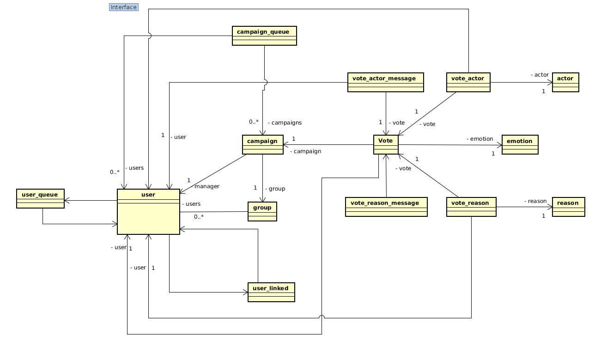
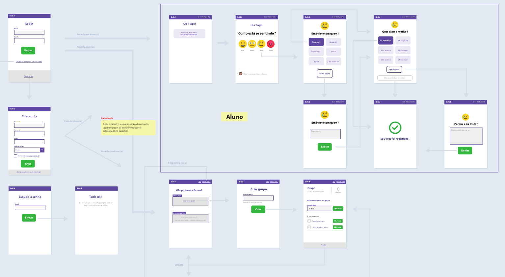
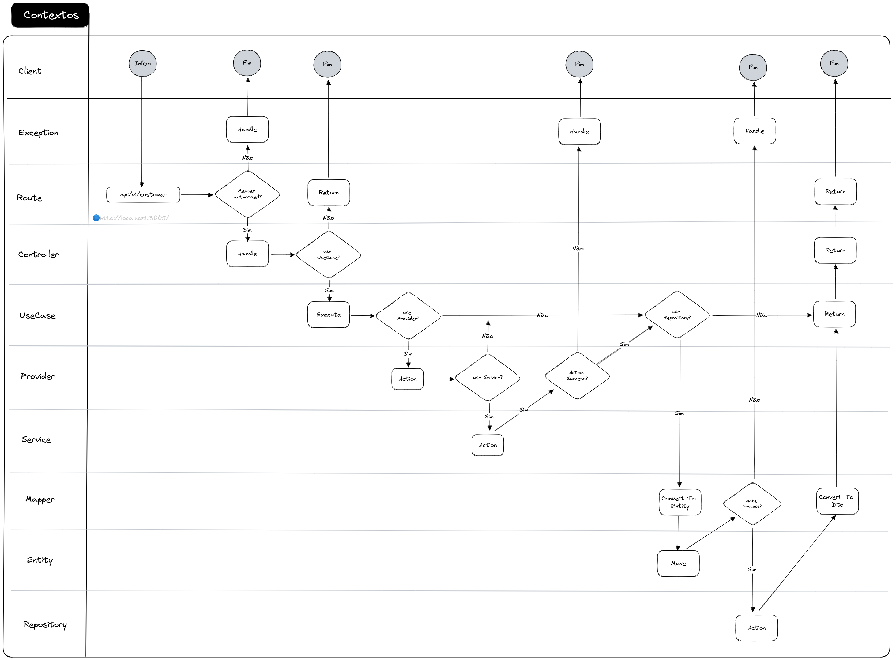
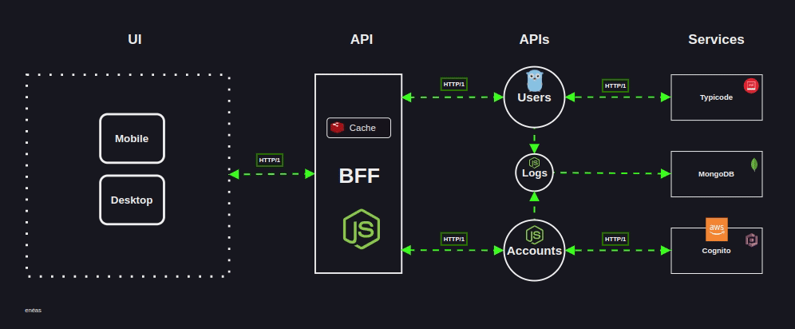
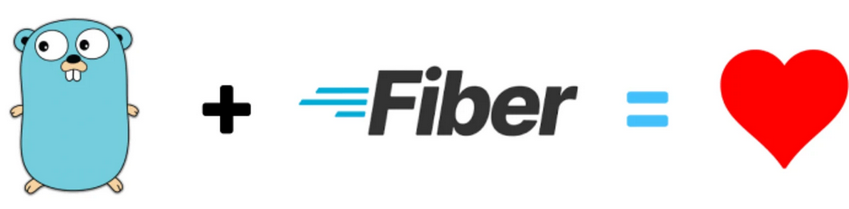
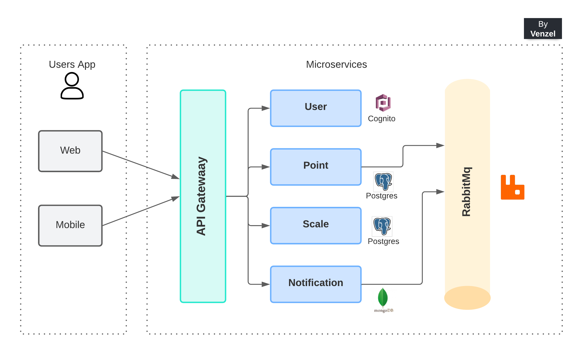
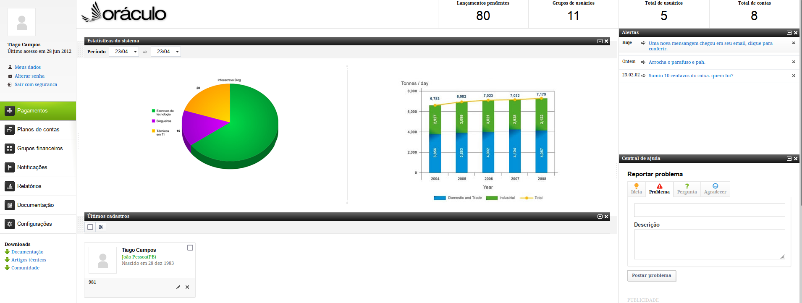
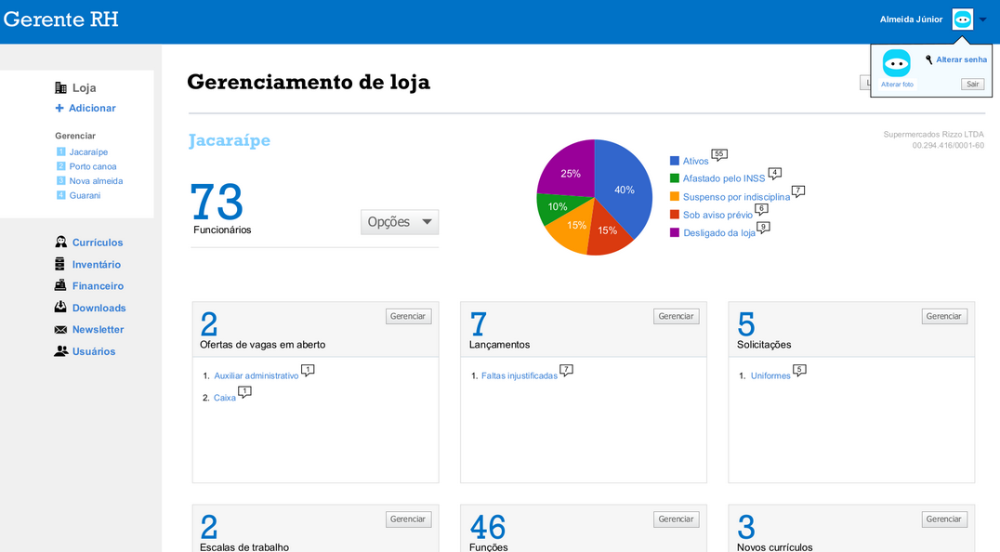
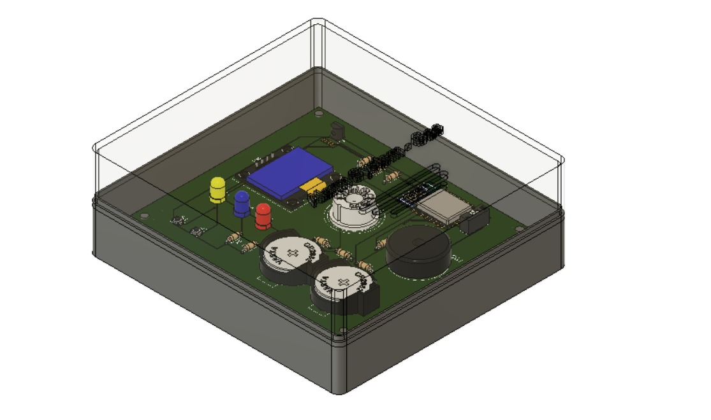
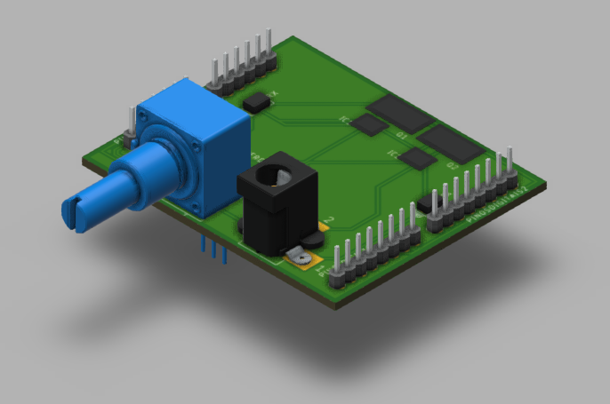

# Enéas Almeida

## Sobre

-   ❤️ 8+ anos de experiência em desenvolvimento moderno;
-   🎓 Bacharel em Engenharia de Computação;
-   🎓 Pós-graduado em Arquitetura de Software Distribuído - [**PUC MINAS**](https://vemprapuc.pucminas.br/arquitetura-de-software-distribuido-2013?variant_id=37515);
-   ☂️ Go Expert [**FULL CYCLE**](https://goexpert.fullcycle.com.br/curso/);
-   Focado nas stacks **NodeJs**, **Go** e **Java**

### +

-   ✝️ Professante da fé em **Jesus Cristo** (meu único Senhor e Salvador);
-   🍖 Fã de churrasco, fez um? me chama! 🔥

## Stacks de atuações

### Backend

-   NodeJs / NestJs / Typescript / Javascript;
-   GoLang;
-   Java;
-   RabbitMQ / Kafka;
-   gRPC;
-   TypeORM / Prisma / Mongoose / Redis / SQL;
-   GraphQL;
-   Python;
-   AWS (S3, DocumentDB, Cognito);
-   Elasticsearch;

### Frontend

-   VueJs 2e3 / Vuetify / Vuero / Pinia / Casl;
-   Angular

+ Sobre

-   Atuação em ambientes com adoção de metodologias ágeis;
-   Atuação em ambientes de pressão com grande volume de dados financeiros;
-   Banco de dados relacional e NoSql;
-   Experiência em desenvolvimento em arquitetura de microsserviços;
-   Experiência em API Manager (Linkapi);
-   Experiência na criação de componentes reutilizáveis;
-   Experiência na utilização de conceitos DDD;
-   SOLID / Clean Architecture;
-   Experiência em desenvolvimento de códigos guiado a testes (TDD);
-   Git / Gitflow / Conventional Commit;
-   UML;
-   BPMN;
-   Docker;
-   Sonarlint;
-   Sentry;
-   keycloak / Cognito (AWS);
-   Documentação de APIs;
-   Compreensão de CI/CD;
-   Jira / Bitrix24 / GitLab.

Técnicas de desenvolvimento utilizadas

-   Fail first;
-   Padronização de commits (conventional commits);
-   Versionamento de módulos para facilitação de refatorações;
-   Modelagem de entidades ricas com tratamento de exceções (Either) (DDD);
-   Desenvolvimento guiado a interfaces;
-   Chaveamento nas injeções de dependências utilizando o padrão strategy;
-   Persistência dos dados em memória para facilitação dos testes unitários;
-   Tratamento de exceções personalizados;
-   Utilizações dos padrões Adapter, Build, Strategy, Barrels, Dto, Factory;
-   Utilização dos pipes validations para validação de dados nos DTOs;
-   Camada de repositórios com ORM TypeORM;
-   Versionamento do banco de dados, através das migrations;
-   Criação dos index nas colunas através das migrations;
-   Mappers para realizar as conversões de dados;
-   Variáveis de ambiente;
-   Interceptadores para criação dos logs da aplicação;
-   Decorators personalizados;
-   Testes unitários com o Jest, guiado pelo coverage reports;
-   Utilização de bibliotecas para transpilar o código mais rapidamente;
-   Rate Limit;
-   Swagger;
-   Filas com o Kafka e RabittMQ;
-   Socket.io;
-   Criação de caches;
-   Interceptação de erros com o sentry;
-   Utilização das bibliotecas: bull, tsryng, ioredis, supertest, mongodb, sentry, moment;
-   Técnica de expurgo;

## Últimos algoritimos desenvolvidos e utilizados em produção

|                  Tecnologia                  | Link                                                                            | O que resolve?                                                         |
| :------------------------------------------: | ------------------------------------------------------------------------------- | ---------------------------------------------------------------------- |
|      | 👉 <a href="https://github.com/eneas-almeida/cache-parallel">Cache Parallel</a> | Requisições externas utilizando estratégia de paralelismo.             |
|  | 👉 <a href="https://github.com/eneas-almeida/go-fetch">Fetch</a>                | Requisição externas utilizando estratégia de paralelismo com fallback. |
|  | 👉 <a href="https://github.com/eneas-almeida/go-upload">Upload</a>              | Upload de arquivos na AWS S3, utilizando estratégia de fallback.       |
|  | 👉 <a href="https://github.com/eneas-almeida/grpc">gRPC</a>                     | Implementação gRPC.                                                    |
|  | 👉 <a href="https://github.com/eneas-almeida/graphql">GraphQL</a>               | Implementação GraphQL.                                                 |

## Bekid

**O que resolve?**

Monitoramento da criança no ambiente escolar através de IA.

👉 <a href="https://github.com/eneas-almeida/bekid">Bekid</a> é um sistema para mapeamento de emoções para o auxílio no combate ao bullying escolar. Aplicação em NodeJs e VueJs. **(finalizado, online em produção)** 

    

## Bestore

👉 <a href="https://github.com/eneas-almeida/bestore">Bestore</a> - Aplicação de venda de produtos. API REST em Java com Spring Boot e Mysql. **(finalizado)** 

## Clean Architecture

O projeto abaixo demonstra as camadas utilizadas em uma arquitetura limpa de microsserviços.

👉 <a href="https://github.com/eneas-almeida/customer-clean-architecture">Guia Clean Architecture</a> - Guia de repasses para equipe.

    

## gRPC

    

👉 <a href="https://github.com/eneas-almeida/grpc">Guia gRPC</a> - Guia de repasses para equipe.

## GraphQL

    

👉 <a href="https://github.com/eneas-almeida/graphql">Guia GraphQL</a> - Guia de repasses para equipe.

## RabbitMQ

    

👉 <a href="https://github.com/eneas-almeida/rabbitmq">Guia RabbitMQ</a> - Guia de repasses para equipe.

## Kafka

    

👉 <a href="https://github.com/eneas-almeida/kafka">Guia Kafka</a> - Guia de repasses para equipe. 
👉 <a href="https://github.com/eneas-almeida/customer-clean-architecture/blob/main/src/infra/services/queue/kafka-queue.service.ts">Implementação de um serviço em Typescript com Kafka</a> 
👉 <a href="https://github.com/eneas-almeida/kafka/tree/master/kafka-nestjs">Kafka + NestJs</a> 
👉 <a href="https://github.com/eneas-almeida/kafka/tree/master/kafka-nodejs">Kafka + NodeJs</a> 
👉 <a href="https://github.com/eneas-almeida/kafka/tree/master/kafka-python">Kafka + Python</a>

## BFF

  

👉 <a href="https://github.com/eneas-almeida/bff">Guia BFF</a> - Guia de repasses para equipe.

## Go Clean Architecture

Account API é um microserviço desenvolvido em Go, que utiliza um padrão arquitetural Clean Architecture.

    

👉 <a href="https://github.com/eneas-almeida/go-account-api-mongodb">Link do projeto</a>

## MyPoint

**O que resolve?**

Problemas de concorrência. Multiplas consultas paralelas e densas, no banco de dados, que levam a exaustão dos recursos de processamento.

    

👉 <a href="https://github.com/eneas-almeida/mypoint">MyPoint</a> é um sistema para registro de pontos de funcionários. Aplicação utilizando microserviços, filas com o RabbitMq, NestJs, VueJs e Socket.io. **(em andamento)** 

### GoLang

    

👉 <a href="https://github.com/eneas-almeida/golang">Instalação, configuração e plugins</a> 
👉 <a href="https://github.com/eneas-almeida/go-routines/">Go routines (caso dos trabalhadores eficiêntes)</a> 
👉 <a href="https://github.com/eneas-almeida/go/tree/main/projects/go-http-retry-backoff">Go http retry with exponential backoff</a> 
👉 <a href="https://github.com/eneas-almeida/go/tree/main/projects/go-algorithms">Go algoritmos</a> 
👉 <a href="https://github.com/eneas-almeida/go/tree/main/projects/go-injections">Go injections</a> 
👉 <a href="https://github.com/eneas-almeida/go/tree/main/projects/go-injections-with-google-wire">Go injections com Google Wire</a> 
👉 <a href="https://github.com/eneas-almeida/go/tree/main/projects/go-viacep">Go API ViaCEP</a> 
👉 <a href="https://github.com/eneas-almeida/go/tree/main/projects/go-encoder">Go encoder</a>  
👉 <a href="https://github.com/eneas-almeida/go/tree/main/projects/go-database">Go database</a>  
👉 <a href="https://github.com/eneas-almeida/go/tree/main/projects/go-clean-architecture-basic">Go clean architecture</a>  
👉 <a href="https://github.com/eneas-almeida/go/tree/main/projects/go-deploy">Go deploy</a>  
👉 <a href="https://github.com/eneas-almeida/go/tree/main/projects/go-validations">Go validations</a>  
👉 <a href="https://github.com/eneas-almeida/go/tree/main/projects/go-configs-dot-env">Go env</a>  
👉 <a href="https://github.com/eneas-almeida/concorrencia-go">Go concorrência</a> (Repositório de terceiro)

### Nodejs

👉 <a href="https://github.com/eneas-almeida/nodejs-http-retry/tree/main">Resiliência de chamadas HTTP com Axios Retry</a> 
👉 <a href="https://github.com/eneas-almeida/nodejs-base">NodeJs Base API</a>

### K8s

👉 <a href="https://github.com/eneas-almeida/k8s">K8s</a> 
👉 <a href="https://github.com/eneas-almeida/istio">Istio</a>

### VueJs 3

👉 <a href="https://github.com/eneas-almeida/vue3-with-casl">VueJs v3 + Pinia + ACLs Casl</a> **(finalizado)** 
👉 <a href="https://github.com/eneas-almeida/vue3-composition-api">VueJs v3 + Composition api + props + emit + watch</a> **(finalizado)**

### Socket.io

👉 <a href="https://github.com/eneas-almeida/socketio_vuejs_nodejs">Socket.io com Vue/Node/Nest</a> - Utilização de sockets com VueJs no frontend e NodeJs/NestJs no backend, estabelecendo comunicação com validação entre tokens JWT, utilizando padrão de projeto observer. ❤️ **(finalizado)**

### Arquitetura com NestJs

👉 <a href="https://github.com/eneas-almeida/nestjs/tree/master/nestjs-value-object">NestJs + Domínios Ricos</a> Arquitetura de uma api rest com NestJs, utilizando a modelagem de **domínios ricos**, através da técnica **value object**, tratamento de exceções com **either** e transformações de dados utilizando os conceitos de **dtos** e **mappers**.

## Mais APIs desenvolvidas

👉 <a href="https://github.com/eneas-almeida/api-evasao-escolar-nestjs">Evasão Escolar</a> - Aplicação para análise da ocorrência da evasão escolar em instituições públicas de nível superior. Backend desenvolvido com Typescript, NestJs, TypeORM e Postgres. **(finalizado, online em produção)** 

👉 <a href="https://github.com/eneas-almeida/api-tindin">Tindin</a> - Aplicação de controle de aulas ministradas. Desenvolvida em NodeJs, utilizando banco de dados MongoDB (TypeORM), com cobertura de testes (coverages), utilizando o Jest. **(finalizado)** 

👉 <a href="https://github.com/eneas-almeida/api-places-to-know">Places to Know</a> - Desenvolvida em NodeJs, com objetivo de gerar um banco de dados de fotos de locais pelo mundo. Os detalhes do projeto são a integração com uma API externa, criação de uma busca com filtro e paginação. **(finalizado)**

## Trabalhos antigos

👉 <a href="https://github.com/eneas-almeida/oraculo">Oráculo</a> - Sistema de gerenciamento financeiro. Frontend desenvolvido em html, javascript e JQuery para empresa cliente. **(finalizado)** 

  

👉 <a href="https://github.com/eneas-almeida/gerente-rh">Gerente RH</a> - Sistema de gerenciamento de funcionários. MVC desenvolvido em C# com Microsoft SQL. **(finalizado)** 

  

## Javascript (5 últimos algoritimos desenvolvidos)

👉 <a href="https://github.com/eneas-almeida/javascript/blob/master/codes/readfileTxtAndConvertValuesToXlsx.js">Read Txt and convert to Xlsx</a> - Realiza a leitura de um arquivo .txt, obtém os valores, gera o arquivo .xlsx e insere os valores lidos do txt e por seguinte, realiza a formatação para o valor moeda R$. **(finalizado)** 

👉 <a href="https://github.com/eneas-almeida/javascript/blob/master/codes/getLevel.js">Get Level</a> - Elimina o uso de vários IF e ELSE de intervalos entre valores. **(finalizado)** 

👉 <a href="https://github.com/eneas-almeida/javascript/blob/master/codes/parseDTO.js">Parse DTO</a> - Transforma as propriedades de um objeto de Camel Case para Snake Case. **(finalizado)** 

👉 <a href="https://github.com/eneas-almeida/javascript/blob/master/codes/fIlterPropertiesInArrayObjects.js">Filter Properties</a> - Filtra as propriedades de um objeto, passando um array indicando os propriedades a serem removidas. **(finalizado)** 

👉 <a href="https://github.com/eneas-almeida/javascript/blob/master/codes/mapEnumObjects.js">MAP Enum</a> - Técnica que utilizo para eliminar grandes quantidades de IFs no sistema. **(finalizado)** 

👉 <a href="https://github.com/eneas-almeida/javascript/tree/master/codes">Todos os scripts</a> **(em andamento)** 

## Estudos sobre testes com o NodeJs

👉 <a href="https://github.com/eneas-almeida/javascript/tree/master/codes/tests/mocks">Mock tests</a> - Estudos sobre tests unitários utilizando mocks e bibliotecas nativas do NodeJs. **(finalizado)** 

👉 <a href="https://github.com/eneas-almeida/javascript/tree/master/codes/tests/stubs">Stub com mocks</a> - Testes utilizando a técnica de stubs para simular uma requisição a uma API. **(finalizado)** 

## Estudos de casos

👉 <a href="https://github.com/eneas-almeida/auth-nest">API Rest SigIn/SigUp</a> - Autenticação e autorização com NestJs, TypeORM, Postgres, JWT, Interceptors, Logger, Jest. **(finalizado)** 

👉 <a href="https://github.com/eneas-almeida/nestjs-with-prisma">API Rest NestJs com Prisma</a> - API Rest utilizando o NestJs com Prisma, Swagger, Postgres, Docker compose, Seed, Validators, Transformers, Pagination, Prisma Exception Handling e Logger. **(finalizado)** 

👉 <a href="https://github.com/eneas-almeida/nodejs-prisma">API Rest NodeJs com Prisma</a> - Cadastro simples de usuários com Prisma, arquitetura Package by Feature e Teste unitário com o Jest. **(finalizado)** 

👉 <a href="https://github.com/eneas-almeida/series-tv-backend">Séries TV</a> - FullStack. Estudo de caso de um fullstack em Spring Boot + Angular 12. **(finalizado)** 

👉 <a href="https://github.com/eneas-almeida/grisoli">Grisoli</a> - Aplicação em uma arquitetura de microserviços utilizando NodeJs com Typescript, Spring Boot, Prisma, TypeORM, Docker, RabbitMQ, testes unitários, CI-CD com github actions. **(abortado)**

👉 <a href="https://github.com/eneas-almeida/vacina_pb">VacinaPB</a> - Estudo de caso **TDD**, desenvolvido em Typescript e NodeJs, utilizando padrões de projetos e modelagem de domínio, baseado em uma arquitetura limpa, de acordo com ensinamentos de Martin Fowler em seu livro sobre refatoração e arquitetura limpa. **(finalizado)** 

👉 <a href="https://github.com/eneas-almeida/modelagem_entidade">Modelgem de entidade (Tiny)</a> - Modelagem de uma entidade em Java, utilizando **Tiny**. A técnica consiste em modelar uma entidade com auxílio de uma classe externa Either.java, de forma que os erros possam ser gerenciados elegantemente. **(finalizado)** 

👉 <a href="https://github.com/eneas-almeida/teste_exaustao">Teste Exaustão (JMeter)</a> - Estudo de caso de aplicação desenvolvida em Typescript + NodeJs. **(finalizado)** 

👉 <a href="https://github.com/eneas-almeida/deploy_codeship">Deploy em QA e Produção</a> - Estudo de caso de integração continua nos serviços da **Codeship**, deploiando em QA e em produção. **(finalizado)** 

👉 <a href="https://github.com/eneas-almeida/create_releases">Create releases</a> - Estudo de caso de criaçao de releases automatizadas no Github. **(finalizado)** 

👉 <a href="https://github.com/eneas-almeida/mongo_spring">API Rest Spring Boot com MongoDB</a> - Estudo de caso de uma api Spring Boot + MongoDB. **(finalizado)** 

👉 <a href="https://github.com/eneas-almeida/agenda_contatos">Agenda de contatos</a> - Servlets em Java. Estudo de caso de uma agenda de contatos. **(finalizado)** 

## VueJs

👉 <a href="https://github.com/eneas-almeida/vuejs_tests">VueJs Tests</a> - Estudo sobre testes com jest e vuetify. **(finalizado)** 

👉 <a href="https://github.com/eneas-almeida/vuejs_upload_xsl">VueJs Upload XSL</a> - Estudo sobre upload de arquivos .xsl com vuetify. 🔒 (privado) **(finalizado)** 

👉 <a href="https://github.com/eneas-almeida/vuejs_checkbox">VueJs Checkbox</a> - Checkbox select com vuetify. **(finalizado)** 

👉 <a href="https://github.com/eneas-almeida/vuejs_select_all">VueJs Select All</a> - Select all com vuetify. **(finalizado)** 

👉 <a href="https://github.com/eneas-almeida/vuejs_vuetify">VueJs Vuetify</a> - Estudo sobre vuetify. 🔒 (privado) **(finalizado)** 

👉 <a href="https://github.com/eneas-almeida/vuejs_geral">VueJs Geral</a> - Estudos gerais. **(finalizado)** 

👉 <a href="https://github.com/eneas-almeida/vuejs_object_change">VueJs Object Change</a> - Estudos de como alterar, deletar propriedades e realizar cópias de objetos. **(finalizado)** 

👉 <a href="https://github.com/eneas-almeida/vuejs_computed">VueJs Computed</a> - Estudo sobre computed com uma diretiva v-for, filtrando pelo status do objeto. **(finalizado)** 

👉 <a href="https://github.com/eneas-almeida/vuejs_form">VueJs Form</a> - Estudo sobre forms. **(finalizado)** 

👉 <a href="https://github.com/eneas-almeida/vuejs_route">VueJs Route</a> - Estudo sobre route. **(finalizado)** 

👉 <a href="https://github.com/eneas-almeida/vuejs_props">VueJs Props</a> - Estudo sobre props. **(finalizado)** 

👉 <a href="https://github.com/eneas-almeida/vuejs_slots">VueJs Slots</a> - Estudo sobre slots. **(finalizado)** 

👉 <a href="https://github.com/eneas-almeida/vuejs_component_dinamic">VueJs Component Dinamic</a> - Estudo sobre componentes dinâmicos. **(finalizado)** 

👉 <a href="https://github.com/eneas-almeida/vuejs_vuex">VueJs Vuex</a> - Estudo sobre o estado compartilhado vuex. **(finalizado)** 

👉 <a href="https://github.com/eneas-almeida/vuejs_vuex_v2">VueJs Vuex v2</a> - Estudo sobre o estado compartilhado vuex v2. **(finalizado)** 

👉 <a href="https://github.com/eneas-almeida/vuejs_axios">VueJs Axios</a> - Estudo sobre o vuejs com o axios. **(finalizado)** 

👉 <a href="https://github.com/eneas-almeida/vuejs_todo">Vuejs Todo + Localstorage</a> - Estudo de caso de um todo de tarefas. **(finalizado)** 

👉 <a href="https://github.com/eneas-almeida/vuejs_burguer">Vuejs Burguer</a> - Estudo de caso de venda de hamburguers. **(finalizado)** 

👉 <a href="https://github.com/eneas-almeida/vuejs_props_by_copy">Vuejs Refs By Copy</a> - Estudo sobre passagem por cópia e por referência. **(finalizado)** 

👉 <a href="https://github.com/eneas-almeida/vuejs_css">Vuejs CSS</a> - Estudo sobre css. **(finalizado)** 

👉 <a href="https://github.com/eneas-almeida/vuejs_filters">Vuejs Filters</a> - Estudo sobre filters. **(finalizado)** 

👉 <a href="https://github.com/eneas-almeida/vuejs_mixins">Vuejs Mixins</a> - Estudo sobre mixins. **(finalizado)** 

## Acadêmico

| Foto                                            | Descrição                                                                                                                                                                                                |
| ----------------------------------------------- | -------------------------------------------------------------------------------------------------------------------------------------------------------------------------------------------------------- |
|  | 👉 <a href="https://github.com/eneas-almeida/sistemas-embarcados">Sistemas Embarcados</a> - Projeto final da disciplina de Sistemas Embarcados em Engenharia de Computação, IFPB. **(finalizado)**  |
|    | 👉 <a href="https://github.com/eneas-almeida/shield_dados">Prototipagem</a> - Projeto final da disciplina de Prototipagem em Engenharia de Computação, IFPB. **(finalizado)**                       |

### Meus tutores e mestres

Os autores citados abaixo são fontes de referências em minha jornada de estudo e trabalho, na maioria deles, participei de cursos que serviram de base para aprofundar meus conhecimentos.

-   Tiago Matos **(VueJs 3, Composition API, Pinia)**
-   João Rangel **(NestJs)**
-   Diego Fernandes **(NestJs, Microserviços e RabbitMQ)**
-   Stephany Henrique **(GoLang)**
-   Otávio Augusto Gallego **(GoLang)**
-   Ellen körbes **(GoLang)**
-   Fernando Daciuk **(Javascript e Git avançado)**
-   Fernando Amaral **(Kafka)**
-   Wesley Willians **(Kafka, GoLang)**
-   Loiane Groner **(Angular)**
-   Leonardo Moura **(VueJs, Docker, Typescript e GraphQL)**
-   Matheus Battisti **(Docker, Kubernetes e VueJs)**
-   Nélio Alves **(Spring Boot)**
-   AlgaWorks **(Spring Boot e Angular)**
-   Otávio Lemos **(Arquitetura e TDD com Typescript)**
-   Ruan Delgado **(Algoritmos e dicas de estudo)**
-   Fábio Akita **(Dicas de estudo Pragmático)**
-   Rocketseat **(Stack backend NodeJs)**
-   Henrique Cunha **(Algoritmos)**
-   César Vasconcelos **(Java)**
-   Otávio Miranda **(Padões de projeto com Typescript)**
-   Erick Wendel **(NodeJs avançado)**
-   Linux Tips **(Linux, Docker e Kubernetes)**
-   Dev Soltinho **(Javascript, Git)**
-   Claudson Oliveira **(Trabalho no exterior, GoLang)**
-   Rodrigo Branas **(Javascript)**
-   Jonathan Baraldi **(DevOps com Rancher, AWS e GCP)**
-   Codar.me **(NodeJs)**
-   Plínio Naves **(VueJs & Vuetify)**
-   Victor Hugo Negrisoli **(Microserviços)**
