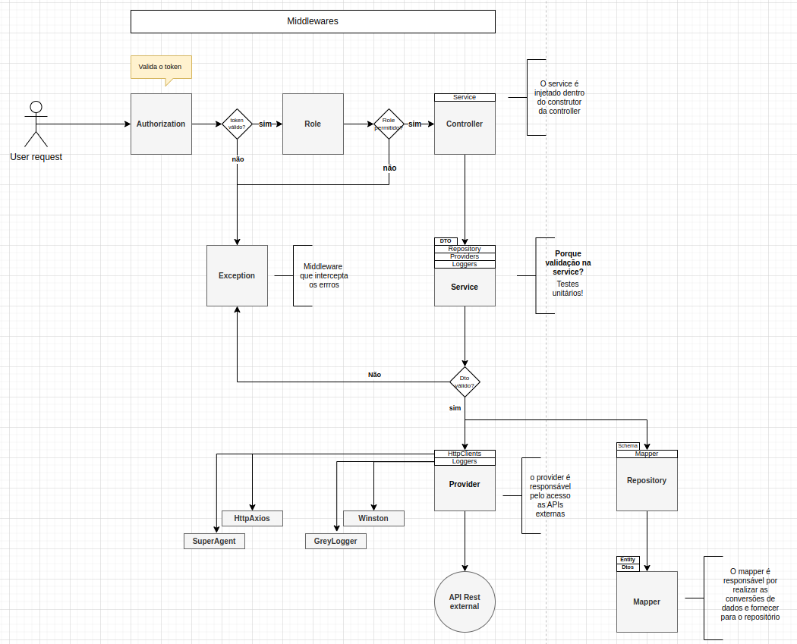

# Enéas Almeida (Venzel)

Atualmente, desenvolvedor backend sênior na **<a href="https://actdigital.com/pt/quem-somos/">ACT Digital</a>**, junto ao cliente  **<a href="https://www.sicoob.com.br/web/sicoob/sistema-sicoob">Sicoob</a>**

## Contatos

👉 [Linkedin](https://www.linkedin.com/in/venzel) 
👉 [Instagram](https://www.instagram.com/eneasalmeidaeng)

## Sobre

-   ❤️ 10+ anos de experiência em desenvolvimento backend e frontend
-   🎓 Bacharel em Engenharia de Computação - [**IFPB**](https://estudante.ifpb.edu.br/cursos/28/)
-   ☂️ Pós-graduando em Arquitetura de Software Distribuído - [**PUC MINAS**](https://vemprapuc.pucminas.br/arquitetura-de-software-distribuido-2013?variant_id=37515)
-   🔥 Focado em assimilar [**Go**](https://github.com/venzel/golang) 

### Curiosidades

-   ✝️ Professante da fé em **Jesus Cristo** (meu único Senhor e Salvador)
-   🍖 Fã de churrasco, fez um? me chama! 🔥🔥🔥
-   ⚽ Torcedor do melhor e mais espetacular time do Brasil (**Vasco**)

### Atuação profissional anterior

-   Engenheiro de Software Sênior na **<a href="https://www.indracompany.com">Indra Company</a>**, empresa espanhola com atuação global, líder mundial no fornecimento de soluções de transporte e defesa aérea, atuando com **VueJs**, **NodeJs** e **Spring Boot** junto ao cliente **<a href="https://www.enel.com.br">Enel</a>**.

### Stacks de atuações

   
    
   
   
   
    
   

-   **NodeJs** (🔥 Especialista)
-   **NestJs** (🔥 Especialista)
-   Typescript / Javascript
-   TypeORM / MySQL / Postgres / MongoDB / Redis
-   **Testes com Jest** (🔥 Especialista)
-   **VueJs/Vuetify** (🔥 Especialista)
-   Angular
-   Socket.io
-   Spring Boot
-   Kafka/RabbitMQ

Interesses

-   Atuação em ambiente de pressão e com adoção de metodologias ágeis;
-   Liderança técnica;
-   Análises, Refatorações e Code Review;
-   Documentação dos processos que envolvem o fluxo de desenvolvimento;
-   Desenvolvimento frontend e backend;
-   Testes unitários e integração;
-   Arquitetura de software;
-   Sustentação.

Experiências

-   Metodologias ágeis;
-   Líder de projeto;
-   Ambiente de pressão e dados sigilosos;
-   Microserviços;
-   Desenvolvimento guiado a interfaces;
-   Sustentação (correção de bugs e melhorias de código);
-   Pré planejamento com UML;
-   Testes unitários e integração;
-   Implementações em memória para facilitação dos casos de testes unitários;
-   Criação de documentações;
-   Refatoração através da técnica de versionamentos;
-   Code Review;
-   Mensageria (RabbitMQ e Kafka);
-   SonarLint;
-   Git / Gitflow / Conventional commits;
-   Github, GitLab, BitBucket;
-   Ambiente Linux;
-   CI-CD;
-   Docker;
-   Nginx;
-   Varnish.

Técnicas de desenvolvimento utilizadas

-   Padronização de commits (conventional commits);
-   Utilização de conceitos de módulos da arquitetura DDD;
-   Versionamento de módulos para facilitação de refatorações;
-   Modelagem de entidades ricas com tratamento de exceções (Either) (DDD);
-   Desenvolvimento guiado a testes (TDD);
-   Desenvolvimento guiado a interfaces;
-   Chaveamento nas injeções de dependências utilizando o padrão strategy;
-   Persistência dos dados em memória para facilitação dos testes unitários;
-   Tratamento de exceções personalizados;
-   Utilizações dos padrões Adapter, Strategy, Barrels, Dto, Factory;
-   Utilização dos pipes validations para validação de dados nos DTOs;
-   Camada de repositórios com ORM TypeORM;
-   Versionamento do banco de dados, através das migrations;
-   Criação dos index nas colunas através das migrations;
-   Mappers para realizar as conversões de dados;
-   Variáveis de ambiente;
-   Interceptadores para criação dos logs da aplicação;
-   Decorators personalizados;
-   Testes unitários com o Jest, guiado pelo coverage reports;
-   Utilização de bibliotecas para transpilar o código mais rapidamente;
-   Rate Limit;
-   Swagger;
-   Filas com o Kafka e RabittMQ;
-   Socket.io;
-   Técnica de strategy guard no typescript;
-   Criação de caches;
-   Interceptação de erros com o sentry;
-   Utilização das bibliotecas: bull, tsryng, ioredis, supertest, mongodb, sentry, moment;
-   Técnica de expurgo de dados com cronjobs.

## Metodologia desenvolvida

O **ciclo** demonstrado no fluxograma abaixo, é uma base de projeto que desenvolvi em NodeJs, utilizando conceitos de uma arquitetura hexagonal.

  

👉 <a href="https://github.com/venzel/nodejs-base
">Código de exemplo</a>

## Trabalhos

### Bekid

👉 <a href="https://github.com/venzel/bekid">Bekid</a> é um sistema para mapeamento de emoções para o auxílio no combate ao bullying escolar. Aplicação monolítica com NodeJs e VueJs. **(finalizado, online em produção)** 

### MyPoint

👉 <a href="https://github.com/venzel/mypoint">MyPoint</a> é um sistema para registro de pontos de funcionários. Aplicação utilizando microserviços, filas com o RabbitMq, NestJs, VueJs e Socket.io. **(em andamento)** 

**O que resolve?**

Problemas de concorrência. Multiplas consultas paralelas e densas, no banco de dados, que levam a exaustão dos recursos de processamento.

### Arquitetura com NestJs

👉 <a href="https://github.com/venzel/nestjs/tree/master/nestjs-value-object">NestJs + Domínios Ricos</a> Arquitetura de uma api rest com NestJs, utilizando a modelagem de **domínios ricos**, através da técnica **value object**, tratamento de exceções com **either** e transformações de dados utilizando os conceitos de **dtos** e **mappers**.

### Go

👉 <a href="https://github.com/venzel/go-api">Go API</a> **(em andamento)** 
👉 <a href="https://github.com/venzel/go-encoder">Go encoder</a> **(em andamento)** 
👉 <a href="https://github.com/venzel/concorrencia-go">Go concorrência</a> **(em andamento, projeto de terceiro)**

### Node

👉 <a href="https://github.com/venzel/nodejs-base">Node Base</a> 🔒 (privado) **(em andamento)**

### Kafka

👉 <a href="https://github.com/venzel/kafka/tree/master/kafka-nestjs">Kafka + NestJs</a> 
👉 <a href="https://github.com/venzel/kafka/tree/master/kafka-nodejs">Kafka + NodeJs</a> 
👉 <a href="https://github.com/venzel/kafka/tree/master/kafka-python">Kafka + Python</a>

### Socket.io

👉 <a href="https://github.com/venzel/socketio_vuejs_nodejs">Socket.io com Vue/Node/Nest</a> - Utilização de sockets com VueJs no frontend e NodeJs/NestJs no backend, estabelecendo comunicação com validação entre tokens JWT, utilizando padrão de projeto observer. ❤️ **(finalizado)**

## Mais APIs desenvolvidas

👉 <a href="https://github.com/venzel/bestore">Bestore</a> - Aplicação de venda de produtos. API REST em Java com Spring Boot e Mysql. **(finalizado)** 

👉 <a href="https://github.com/venzel/api-evasao-escolar-nestjs">Evasão Escolar</a> - Aplicação para análise da ocorrência da evasão escolar em instituições públicas de nível superior. Backend desenvolvido com Typescript, NestJs, TypeORM e Postgres. **(finalizado, online em produção)** 

👉 <a href="https://github.com/venzel/api-tindin">Tindin</a> - Aplicação de controle de aulas ministradas. Desenvolvida em NodeJs, utilizando banco de dados MongoDB (TypeORM), com cobertura de testes (coverages), utilizando o Jest. **(finalizado)** 

👉 <a href="https://github.com/venzel/api-places-to-know">Places to Know</a> - Desenvolvida em NodeJs, com objetivo de gerar um banco de dados de fotos de locais pelo mundo. Os detalhes do projeto são a integração com uma API externa, criação de uma busca com filtro e paginação. **(finalizado)**

## Acadêmico

| Foto                                            | Descrição                                                                                                                                                                                         |
| ----------------------------------------------- | ------------------------------------------------------------------------------------------------------------------------------------------------------------------------------------------------- |
|  | 👉 <a href="https://github.com/venzel/sistemas-embarcados">Sistemas Embarcados</a> - Projeto final da disciplina de Sistemas Embarcados em Engenharia de Computação, IFPB. **(finalizado)**  |
|    | 👉 <a href="https://github.com/venzel/shield_dados">Prototipagem</a> - Projeto final da disciplina de Prototipagem em Engenharia de Computação, IFPB. **(finalizado)**                       |

## Trabalhos antigos

👉 <a href="https://github.com/venzel/oraculo">Oráculo</a> - Sistema de gerenciamento financeiro. Frontend desenvolvido em html, javascript e JQuery para empresa cliente. **(finalizado)** 

👉 <a href="https://github.com/venzel/gerente-rh">Gerente RH</a> - Sistema de gerenciamento de funcionários. MVC desenvolvido em C# com Microsoft SQL. **(finalizado)** 

## Javascript (4 últimos algoritimos desenvolvidos)

👉 <a href="https://github.com/venzel/javascript/blob/master/codes/getLevel.js">Get Level</a> - Elimina o uso de vários IF e ELSE de intervalos entre valores. **(finalizado)** 

👉 <a href="https://github.com/venzel/javascript/blob/master/codes/parseDTO.js">Parse DTO</a> - Transforma as propriedades de um objeto de Camel Case para Snake Case. **(finalizado)** 

👉 <a href="https://github.com/venzel/javascript/blob/master/codes/fIlterPropertiesInArrayObjects.js">Filter Properties</a> - Filtra as propriedades de um objeto, passando um array indicando os propriedades a serem removidas. **(finalizado)** 

👉 <a href="https://github.com/venzel/javascript/blob/master/codes/mapEnumObjects.js">MAP Enum</a> - Técnica que utilizo para eliminar grandes quantidades de IFs no sistema. **(finalizado)** 

👉 <a href="https://github.com/venzel/javascript/tree/master/codes">Todos os scripts</a> **(em andamento)** 

## Estudos sobre testes com o NodeJs

👉 <a href="https://github.com/venzel/javascript/tree/master/codes/tests/mocks">Mock tests</a> - Estudos sobre tests unitários utilizando mocks e bibliotecas nativas do NodeJs. **(finalizado)** 

👉 <a href="https://github.com/venzel/javascript/tree/master/codes/tests/stubs">Stub com mocks</a> - Testes utilizando a técnica de stubs para simular uma requisição a uma API. **(finalizado)** 

## Estudos de casos

👉 <a href="https://github.com/venzel/auth-nest">API Rest SigIn/SigUp</a> - Autenticação e autorização com NestJs, TypeORM, Postgres, JWT, Interceptors, Logger, Jest. **(finalizado)** 

👉 <a href="https://github.com/venzel/nestjs-with-prisma">API Rest NestJs com Prisma</a> - API Rest utilizando o NestJs com Prisma, Swagger, Postgres, Docker compose, Seed, Validators, Transformers, Pagination, Prisma Exception Handling e Logger. **(finalizado)** 

👉 <a href="https://github.com/venzel/nodejs-prisma">API Rest NodeJs com Prisma</a> - Cadastro simples de usuários com Prisma, arquitetura Package by Feature e Teste unitário com o Jest. **(finalizado)** 

👉 <a href="https://github.com/venzel/series-tv-backend">Séries TV</a> - FullStack. Estudo de caso de um fullstack em Spring Boot + Angular 12. **(finalizado)** 

👉 <a href="https://github.com/venzel/grisoli">Grisoli</a> - Aplicação em uma arquitetura de microserviços utilizando NodeJs com Typescript, Spring Boot, Prisma, TypeORM, Docker, RabbitMQ, testes unitários, CI-CD com github actions. **(abortado)**

👉 <a href="https://github.com/venzel/vacina_pb">VacinaPB</a> - Estudo de caso **TDD**, desenvolvido em Typescript e NodeJs, utilizando padrões de projetos e modelagem de domínio, baseado em uma arquitetura limpa, de acordo com ensinamentos de Martin Fowler em seu livro sobre refatoração e arquitetura limpa. **(finalizado)** 

👉 <a href="https://github.com/venzel/modelagem_entidade">Modelgem de entidade (Tiny)</a> - Modelagem de uma entidade em Java, utilizando **Tiny**. A técnica consiste em modelar uma entidade com auxílio de uma classe externa Either.java, de forma que os erros possam ser gerenciados elegantemente. **(finalizado)** 

👉 <a href="https://github.com/venzel/teste_exaustao">Teste Exaustão (JMeter)</a> - Estudo de caso de aplicação desenvolvida em Typescript + NodeJs. **(finalizado)** 

👉 <a href="https://github.com/venzel/deploy_codeship">Deploy em QA e Produção</a> - Estudo de caso de integração continua nos serviços da **Codeship**, deploiando em QA e em produção. **(finalizado)** 

👉 <a href="https://github.com/venzel/create_releases">Create releases</a> - Estudo de caso de criaçao de releases automatizadas no Github. **(finalizado)** 

👉 <a href="https://github.com/venzel/mongo_spring">API Rest Spring Boot com MongoDB</a> - Estudo de caso de uma api Spring Boot + MongoDB. **(finalizado)** 

👉 <a href="https://github.com/venzel/agenda_contatos">Agenda de contatos</a> - Servlets em Java. Estudo de caso de uma agenda de contatos. **(finalizado)** 

## VueJs

👉 <a href="https://github.com/venzel/vuejs_tests">VueJs Tests</a> - Estudo sobre testes com jest e vuetify. **(em andamento)** 

👉 <a href="https://github.com/venzel/vuejs_upload_xsl">VueJs Upload XSL</a> - Estudo sobre upload de arquivos .xsl com vuetify. 🔒 (privado) **(finalizado)** 

👉 <a href="https://github.com/venzel/vuejs_checkbox">VueJs Checkbox</a> - Checkbox select com vuetify. **(finalizado)** 

👉 <a href="https://github.com/venzel/vuejs_select_all">VueJs Select All</a> - Select all com vuetify. **(finalizado)** 

👉 <a href="https://github.com/venzel/vuejs_vuetify">VueJs Vuetify</a> - Estudo sobre vuetify. 🔒 (privado) **(finalizado)** 

👉 <a href="https://github.com/venzel/vuejs_geral">VueJs Geral</a> - Estudos gerais. **(finalizado)** 

👉 <a href="https://github.com/venzel/vuejs_object_change">VueJs Object Change</a> - Estudos de como alterar, deletar propriedades e realizar cópias de objetos. **(finalizado)** 

👉 <a href="https://github.com/venzel/vuejs_computed">VueJs Computed</a> - Estudo sobre computed com uma diretiva v-for, filtrando pelo status do objeto. **(finalizado)** 

👉 <a href="https://github.com/venzel/vuejs_form">VueJs Form</a> - Estudo sobre forms. **(finalizado)** 

👉 <a href="https://github.com/venzel/vuejs_route">VueJs Route</a> - Estudo sobre route. **(finalizado)** 

👉 <a href="https://github.com/venzel/vuejs_props">VueJs Props</a> - Estudo sobre props. **(finalizado)** 

👉 <a href="https://github.com/venzel/vuejs_slots">VueJs Slots</a> - Estudo sobre slots. **(finalizado)** 

👉 <a href="https://github.com/venzel/vuejs_component_dinamic">VueJs Component Dinamic</a> - Estudo sobre componentes dinâmicos. **(finalizado)** 

👉 <a href="https://github.com/venzel/vuejs_vuex">VueJs Vuex</a> - Estudo sobre o estado compartilhado vuex. **(finalizado)** 

👉 <a href="https://github.com/venzel/vuejs_vuex_v2">VueJs Vuex v2</a> - Estudo sobre o estado compartilhado vuex v2. **(finalizado)** 

👉 <a href="https://github.com/venzel/vuejs_axios">VueJs Axios</a> - Estudo sobre o vuejs com o axios. **(finalizado)** 

👉 <a href="https://github.com/venzel/vuejs_todo">Vuejs Todo + Localstorage</a> - Estudo de caso de um todo de tarefas. **(finalizado)** 

👉 <a href="https://github.com/venzel/vuejs_burguer">Vuejs Burguer</a> - Estudo de caso de venda de hamburguers. **(finalizado)** 

👉 <a href="https://github.com/venzel/vuejs_props_by_copy">Vuejs Refs By Copy</a> - Estudo sobre passagem por cópia e por referência. **(finalizado)** 

👉 <a href="https://github.com/venzel/vuejs_css">Vuejs CSS</a> - Estudo sobre css. **(finalizado)** 

👉 <a href="https://github.com/venzel/vuejs_filters">Vuejs Filters</a> - Estudo sobre filters. **(finalizado)** 

👉 <a href="https://github.com/venzel/vuejs_mixins">Vuejs Mixins</a> - Estudo sobre mixins. **(finalizado)** 

## Áreas de conhecimento

### Arquiteturas

-   Onion;
-   DDD;
-   Hexagonal;
-   Package by Feature.

### Stack NodeJs

  
   
  
  
  
  

-   NodeJs / Express / NestJs; 🔥🔥🔥
-   Design Patterns (SOLID, Clean Code);
-   Typescript / Javascript;
-   TypeORM / Postgres / MongoDB / Redis;
-   Prisma;
-   Testes unitários;
-   Testes e2e;
-   Socket.io.

### Stack Spring Boot

  
   

-   Java / Spring Boot / JPA / Hibernate
-   MySQL / Postgres/ MongoDB

### Frontend

-   VueJs/Vuetify (🔥 Especialista)
-   Angular
-   Axios
-   HTML
-   LESS/CSS
-   JQuery
-   Typescript/Javascript

### Meus tutores e mestres

Os autores citados abaixo são fontes de referências em minha jornada de estudo e trabalho, na maioria deles, participei de cursos que serviram de base para aprofundar meus conhecimentos.

-   João Rangel **(NestJs)**
-   Diego Fernandes **(NestJs, Microserviços e RabbitMQ)**
-   Stephany Henrique **(GoLang)**
-   Otávio Augusto Gallego **(GoLang)**
-   Ellen körbes **(GoLang)**
-   Fernando Daciuk **(Javascript e Git avançado)**
-   Fernando Amaral **(Kafka)**
-   Wesley Willians **(Kafka)**
-   Loiane Groner **(Angular)**
-   Leonardo Moura **(VueJs, Docker, Typescript e GraphQL)**
-   Matheus Battisti **(Docker, Kubernetes e VueJs)**
-   Nélio Alves **(Spring Boot)**
-   AlgaWorks **(Spring Boot e Angular)**
-   Otávio Lemos **(Arquitetura e TDD com Typescript)**
-   Ruan Delgado **(Algoritmos e dicas de estudo)**
-   Fábio Akita **(Dicas de estudo Pragmático)**
-   Rocketseat **(Stack backend NodeJs)**
-   Henrique Cunha **(Algoritmos)**
-   César Vasconcelos **(Java)**
-   Otávio Miranda **(Padões de projeto com Typescript)**
-   Erick Wendel **(NodeJs avançado)**
-   Linux Tips **(Linux, Docker e Kubernetes)**
-   Dev Soltinho **(Javascript, Git)**
-   Claudson Oliveira **(Trabalho no exterior, GoLang)**
-   Rodrigo Branas **(Javascript)**
-   Jonathan Baraldi **(DevOps com Rancher, AWS e GCP)**
-   Codar.me **(NodeJs)**
-   Plínio Naves **(VueJs & Vuetify)**
-   Victor Hugo Negrisoli **(Microserviços)**
