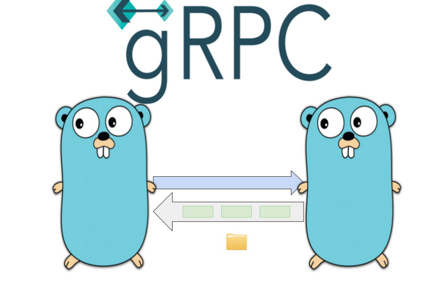

<div align="center">

# Enéas Almeida

### Engenheiro de Software | Arquiteto de Soluções | Especialista em Microserviços


</div>

---

## Resumo Executivo

**9+ anos** de experiência em desenvolvimento de software com foco em **arquitetura de microserviços**, **sistemas distribuídos** e **alta performance**. Especialista em construir soluções escaláveis que processam milhões de transações financeiras mensalmente.

### Destaques Profissionais

- **Impacto de Negócio:** Desenvolvedor principal de microserviços que processam **R$ 6 milhões/mês** no Sicoob
- **Arquitetura:** 11 microserviços em produção com integrações complexas (Oracle, Vtex, Siebel, Salesforce)
- **Stack Completo:** Backend (Node.js, Java, Go) + Frontend (Vue.js, React, Angular)
- **DevOps & Cloud:** Kubernetes, AWS, Docker, Terraform, CI/CD
- **Padrões:** Clean Architecture, DDD, CQRS, Event-Driven, gRPC, GraphQL

### Formação & Certificações

- **Bacharel em Engenharia de Computação** - Instituto Federal da Paraíba
- **Pós-graduação em Arquitetura de Software Distribuído** - PUC Minas
- **MBA em Engenharia de Software com IA** - Full Cycle (em andamento)
- **Go Expert** - Full Cycle
- **Especialista Microserviços com Java** - AlgaWorks (em andamento)

---

## Experiência Destacada

### Sicoob - Desenvolvedor Principal de Microserviços

**Impacto:** Microserviços em produção gerando **R$ 6 milhões/mês**

Responsável pela migração e desenvolvimento de **11 microserviços** (4 principais + 7 auxiliares) para o programa de fidelidade do cartão Sicoob, com transferência de pontos para:

- Livelo
- Decolar
- Smiles
- Azul
- Latam

**Integrações Complexas:**
- Oracle
- Vtex
- Siebel
- Salesforce
- Diversos webservices de validação

**Processo de Desenvolvimento:**


**Arquitetura de Solução:**

<div align="center">

<br/>
<i>Diagrama BPMN - Fluxo de transferência de pontos (dados sensíveis removidos)</i>
</div>

**Tecnologias:** Java, Spring Boot, Microserviços, Oracle, REST APIs, Mensageria, BPMN

---

## Projetos Principais

### [Bridge - Arquitetura gRPC com Java](https://github.com/eneas-almeida/bridge)

<a href="https://github.com/eneas-almeida/bridge">
  
</a>

Arquitetura de microserviços com comunicação gRPC de alta performance entre serviços REST e backend.

**Arquitetura:**

```
┌──────────────┐     HTTP/REST      ┌──────────────┐      gRPC       ┌──────────────┐     HTTP
│   Cliente    │ ─────────────────> │  API Service │ ──────────────> │People Service│ ──────────> JSONPlaceholder
│  (Browser)   │                    │  (Port 8081) │                 │ (Port 9090)  │             (External API)
└──────────────┘                    └──────────────┘                 └──────────────┘
```

**Stack:**     

---

### [Sensors - Microserviços com RabbitMQ](https://github.com/eneas-almeida/ms-sensors-central)

<a href="https://github.com/eneas-almeida/ms-sensors-central">
  
</a>

Sistema de microserviços com comunicação assíncrona via RabbitMQ, implementando padrões de resiliência.

**Evolução Arquitetural:**
1. Sistema monolítico inicial
2. Refatoração para microserviços
3. Implementação de message broker
4. Padrões de retry e dead letter queue

**Stack:**      

---

### [Luizalabs - Clean Architecture Fullstack](https://github.com/eneas-almeida/luizalabs)

<p align="center">
  <a href="https://github.com/eneas-almeida/luizalabs">
    
  </a>
</p>

Aplicação fullstack com Clean Architecture, TDD e design patterns avançados.

**Características:**
- Backend em Node.js com Clean Architecture
- Frontend responsivo em Vue.js
- Testes unitários com Jest (alta cobertura)
- Padrões: Strategy, Adapter, Factory, Builder
- Documentação técnica completa

**Stack:**      

---

### [Bekid - IA para Monitoramento Escolar](https://github.com/eneas-almeida/bekid)

<p align="center">
  <a href="https://github.com/eneas-almeida/bekid">
    
  </a>
</p>

Sistema de mapeamento de emoções com IA para combate ao bullying escolar.

**Solução:**
- Monitoramento em tempo real via IA
- Análise comportamental e emocional
- Dashboard para gestores educacionais
- WebSocket para atualizações em tempo real

**Status:** Em produção

<a href="https://github.com/eneas-almeida/bekid">
  
</a>

**Stack:**    

---

### [MyPoint - Sistema de Ponto com Alta Concorrência](https://github.com/eneas-almeida/mypoint)

<p align="center">
  <a href="https://github.com/eneas-almeida/mypoint">
    
  </a>
</p>

Sistema de registro de ponto com arquitetura otimizada para alta concorrência.

**Desafio Resolvido:**
Múltiplas consultas paralelas e densas no banco de dados que levam à exaustão de recursos.

**Solução:**
- Arquitetura de microserviços
- Filas com RabbitMQ
- Cache distribuído
- WebSocket para atualizações em tempo real

**Stack:**     

---

### [Events-Nest - CQRS + Clean Architecture](https://github.com/eneas-almeida/events-nest)

Microserviço baseado em eventos com CQRS pattern e Clean Architecture em NestJS.

**Padrões Implementados:**
- CQRS (Command Query Responsibility Segregation)
- Event Sourcing
- Clean Architecture
- Domain-Driven Design (DDD)

**Stack:**    

---

## Stack Técnica Completa

### Backend

#### Linguagens & Frameworks


#### Arquitetura & Design


#### Banco de Dados


#### Mensageria & Eventos


### Frontend


### DevOps & Cloud


### Monitoramento & Observabilidade


---

## Algoritmos & Bibliotecas em Produção

Soluções otimizadas desenvolvidas e utilizadas em ambientes de produção:

| Tecnologia | Projeto | Solução |
|:----------:|---------|---------|
|  | [Cache Parallel](https://github.com/eneas-almeida/cache-parallel) | Requisições externas com paralelismo otimizado |
|  | [Fetch](https://github.com/eneas-almeida/go-fetch) | Requisições paralelas com fallback automático |
|  | [Upload](https://github.com/eneas-almeida/go-upload) | Upload AWS S3 com estratégia de fallback |
|  | [gRPC](https://github.com/eneas-almeida/grpc) | Implementação gRPC de alta performance |
|  | [GraphQL](https://github.com/eneas-almeida/graphql) | API GraphQL com resolvers otimizados |

---

## Guias Técnicos & Documentação

Documentação técnica criada para repasse de conhecimento:

<table>
<tr>
<td width="50%">

### [Clean Architecture](https://github.com/eneas-almeida/customer-clean-architecture)

<p align="center">
  <a href="https://github.com/eneas-almeida/customer-clean-architecture">
    
  </a>
</p>

Guia completo sobre camadas e implementação de Clean Architecture em microserviços.

</td>
<td width="50%">

### [gRPC](https://github.com/eneas-almeida/grpc)

<p align="center">
  <a href="https://github.com/eneas-almeida/grpc">
    
  </a>
</p>

Implementação e boas práticas de gRPC com Go.

</td>
</tr>
<tr>
<td width="50%">

### [GraphQL](https://github.com/eneas-almeida/graphql)

<p align="center">
  <a href="https://github.com/eneas-almeida/graphql">
    
  </a>
</p>

Guia de implementação GraphQL com Go.

</td>
<td width="50%">

### [RabbitMQ](https://github.com/eneas-almeida/rabbitmq)

<p align="center">
  <a href="https://github.com/eneas-almeida/rabbitmq">
    
  </a>
</p>

Padrões e implementação de mensageria com RabbitMQ.

</td>
</tr>
</table>

### [Kafka](https://github.com/eneas-almeida/kafka)

<p align="center">
  <a href="https://github.com/eneas-almeida/kafka">
    
  </a>
</p>

**Implementações:**
- [Kafka + NestJS](https://github.com/eneas-almeida/kafka/tree/master/kafka-nestjs)
- [Kafka + Node.js](https://github.com/eneas-almeida/kafka/tree/master/kafka-nodejs)
- [Kafka + Python](https://github.com/eneas-almeida/kafka/tree/master/kafka-python)
- [Serviço TypeScript](https://github.com/eneas-almeida/customer-clean-architecture/blob/main/src/infra/services/queue/kafka-queue.service.ts)

### [BFF (Backend for Frontend)](https://github.com/eneas-almeida/bff)

<p align="center">
  <a href="https://github.com/eneas-almeida/bff">
    
  </a>
</p>

Padrão BFF para otimização de APIs por cliente.

---

## Outros Projetos Relevantes

<details>
<summary><b>Projetos Fullstack & APIs</b></summary>

### [Bestore - E-commerce API](https://github.com/eneas-almeida/bestore)

API REST completa para e-commerce com Java Spring Boot e MySQL.


**Stack:**   

---

### [Go Account API - Clean Architecture](https://github.com/eneas-almeida/go-account-api-mongodb)

<p align="center">
  <a href="https://github.com/eneas-almeida/go-account-api-mongodb">
    
  </a>
</p>

Microserviço em Go com Clean Architecture, Fiber Framework e MongoDB.

**Stack:**   

---

### APIs Produção

[**Evasão Escolar**](https://github.com/eneas-almeida/api-evasao-escolar-nestjs) - Análise de evasão escolar com NestJS, TypeORM e PostgreSQL. **Em produção.**

[**Tindin**](https://github.com/eneas-almeida/api-tindin) - Controle de aulas com Node.js, MongoDB e testes Jest com alta cobertura.

[**Places to Know**](https://github.com/eneas-almeida/api-places-to-know) - API de locais turísticos com integração externa, filtros e paginação.

</details>

<details>
<summary><b>Estudos de Caso & Arquitetura</b></summary>

### Autenticação & Segurança

[**Auth NestJS**](https://github.com/eneas-almeida/auth-nest) - Sistema completo de autenticação com JWT, interceptors, logger e testes.

**Stack:**    

---

### Prisma ORM

[**NestJS + Prisma**](https://github.com/eneas-almeida/nestjs-with-prisma) - API com Prisma, Swagger, validação, paginação e exception handling.

[**Node.js + Prisma**](https://github.com/eneas-almeida/nodejs-prisma) - Arquitetura Package by Feature com testes unitários.

---

### TDD & Domain Modeling

[**VacinaPB**](https://github.com/eneas-almeida/vacina_pb) - TDD com TypeScript, padrões de projeto e modelagem de domínio rica (DDD).

[**Modelagem de Entidade (Tiny)**](https://github.com/eneas-almeida/modelagem_entidade) - Modelagem com Either pattern para tratamento elegante de erros.

---

### Performance & DevOps

[**Teste de Exaustão (JMeter)**](https://github.com/eneas-almeida/teste_exaustao) - Testes de carga e performance com JMeter.

[**Deploy CI/CD**](https://github.com/eneas-almeida/deploy_codeship) - Integração contínua com deploy em QA e Produção.

[**Create Releases**](https://github.com/eneas-almeida/create_releases) - Automação de releases no GitHub.

---

### Fullstack

[**Séries TV**](https://github.com/eneas-almeida/series-tv-backend) - Spring Boot + Angular 12 fullstack.

[**Grisoli**](https://github.com/eneas-almeida/grisoli) - Microserviços com Node.js, Spring Boot, RabbitMQ, Docker e CI/CD.

</details>

<details>
<summary><b>GoLang - Projetos & Algoritmos</b></summary>

<p align="center">
  
</p>

### Recursos & Tutoriais

- [Instalação e Configuração](https://github.com/eneas-almeida/golang)
- [Go Routines - Trabalhadores Eficientes](https://github.com/eneas-almeida/go-routines/)
- [HTTP Retry com Exponential Backoff](https://github.com/eneas-almeida/go/tree/main/projects/go-http-retry-backoff)
- [Algoritmos](https://github.com/eneas-almeida/go/tree/main/projects/go-algorithms)
- [Dependency Injection](https://github.com/eneas-almeida/go/tree/main/projects/go-injections)
- [DI com Google Wire](https://github.com/eneas-almeida/go/tree/main/projects/go-injections-with-google-wire)
- [API ViaCEP](https://github.com/eneas-almeida/go/tree/main/projects/go-viacep)
- [Encoder](https://github.com/eneas-almeida/go/tree/main/projects/go-encoder)
- [Database](https://github.com/eneas-almeida/go/tree/main/projects/go-database)
- [Clean Architecture](https://github.com/eneas-almeida/go/tree/main/projects/go-clean-architecture-basic)
- [Deploy](https://github.com/eneas-almeida/go/tree/main/projects/go-deploy)
- [Validations](https://github.com/eneas-almeida/go/tree/main/projects/go-validations)
- [Environment Config](https://github.com/eneas-almeida/go/tree/main/projects/go-configs-dot-env)
- [Concorrência](https://github.com/eneas-almeida/concorrencia-go)

</details>

<details>
<summary><b>Node.js - Resiliência & Performance</b></summary>

### Projetos

[**HTTP Retry com Axios**](https://github.com/eneas-almeida/nodejs-http-retry/tree/main) - Resiliência de chamadas HTTP com retry automático.

[**Node.js Base API**](https://github.com/eneas-almeida/nodejs-base) - Template base para APIs Node.js.

**Stack:**  

</details>

<details>
<summary><b>Kubernetes & Infraestrutura</b></summary>

### Projetos

[**Kubernetes**](https://github.com/eneas-almeida/k8s) - Configurações e manifestos K8s.

[**Istio**](https://github.com/eneas-almeida/istio) - Service mesh com Istio.

**Stack:**  

</details>

<details>
<summary><b>Vue.js - Projetos & Componentes</b></summary>

### Vue.js 3

[**Vue 3 + Pinia + CASL ACL**](https://github.com/eneas-almeida/vue3-with-casl) - Controle de acesso com Vue 3.

[**Vue 3 Composition API**](https://github.com/eneas-almeida/vue3-composition-api) - Props, emit e watch com Composition API.

---

### Socket.io

[**Socket.io com Vue/Node/NestJS**](https://github.com/eneas-almeida/socketio_vuejs_nodejs) - Comunicação real-time com validação JWT e padrão Observer.

---

### NestJS Avançado

[**NestJS + Value Objects**](https://github.com/eneas-almeida/nestjs/tree/master/nestjs-value-object) - Domínios ricos com Value Objects, Either e DTOs.

---

### Estudos Vue.js

- [Testes com Jest](https://github.com/eneas-almeida/vuejs_tests)
- [Checkbox Select](https://github.com/eneas-almeida/vuejs_checkbox)
- [Select All](https://github.com/eneas-almeida/vuejs_select_all)
- [Computed Properties](https://github.com/eneas-almeida/vuejs_computed)
- [Forms](https://github.com/eneas-almeida/vuejs_form)
- [Routing](https://github.com/eneas-almeida/vuejs_route)
- [Props](https://github.com/eneas-almeida/vuejs_props)
- [Slots](https://github.com/eneas-almeida/vuejs_slots)
- [Componentes Dinâmicos](https://github.com/eneas-almeida/vuejs_component_dinamic)
- [Vuex](https://github.com/eneas-almeida/vuejs_vuex)
- [Axios](https://github.com/eneas-almeida/vuejs_axios)
- [Todo + LocalStorage](https://github.com/eneas-almeida/vuejs_todo)
- [Burger Shop](https://github.com/eneas-almeida/vuejs_burguer)
- [Refs By Copy](https://github.com/eneas-almeida/vuejs_props_by_copy)
- [CSS](https://github.com/eneas-almeida/vuejs_css)
- [Filters](https://github.com/eneas-almeida/vuejs_filters)
- [Mixins](https://github.com/eneas-almeida/vuejs_mixins)

</details>

<details>
<summary><b>JavaScript - Algoritmos & Utilidades</b></summary>

### Algoritmos Desenvolvidos

[**Read TXT → XLSX**](https://github.com/eneas-almeida/javascript/blob/master/codes/readfileTxtAndConvertValuesToXlsx.js) - Conversão de TXT para Excel com formatação monetária.

[**Get Level**](https://github.com/eneas-almeida/javascript/blob/master/codes/getLevel.js) - Eliminação de múltiplos IF/ELSE para intervalos.

[**Parse DTO**](https://github.com/eneas-almeida/javascript/blob/master/codes/parseDTO.js) - Conversão CamelCase → SnakeCase.

[**Filter Properties**](https://github.com/eneas-almeida/javascript/blob/master/codes/fIlterPropertiesInArrayObjects.js) - Filtro de propriedades em objetos.

[**MAP Enum**](https://github.com/eneas-almeida/javascript/blob/master/codes/mapEnumObjects.js) - Técnica para eliminar IFs usando enums.

[**Todos os Scripts**](https://github.com/eneas-almeida/javascript/tree/master/codes)

---

### Testes Unitários

[**Mock Tests**](https://github.com/eneas-almeida/javascript/tree/master/codes/tests/mocks) - Testes com mocks e bibliotecas nativas.

[**Stub com Mocks**](https://github.com/eneas-almeida/javascript/tree/master/codes/tests/stubs) - Simulação de requisições API.

</details>

<details>
<summary><b>Projetos Acadêmicos</b></summary>

| Projeto | Descrição | Imagem |
|---------|-----------|--------|
| [**Sistemas Embarcados**](https://github.com/eneas-almeida/sistemas-embarcados) | Projeto final - Engenharia de Computação IFPB |  |
| [**Prototipagem**](https://github.com/eneas-almeida/shield_dados) | Projeto final de Prototipagem - IFPB |  |

</details>

<details>
<summary><b>Projetos Legados</b></summary>

### [Oráculo - Sistema Financeiro](https://github.com/eneas-almeida/oraculo)

Sistema de gerenciamento financeiro desenvolvido em HTML, JavaScript e jQuery.

<p align="center">
  
</p>

---

### [Gerente RH](https://github.com/eneas-almeida/gerente-rh)

Sistema de gerenciamento de funcionários em C# MVC com Microsoft SQL Server.

<p align="center">
  
</p>

</details>

---

## Técnicas & Práticas de Desenvolvimento

<details>
<summary><b>Metodologias & Padrões</b></summary>

### Práticas de Código

- Fail First Development
- Conventional Commits
- Versionamento de módulos
- Test-Driven Development (TDD)
- Desenvolvimento guiado a interfaces
- Modelagem de entidades ricas (DDD)
- Tratamento de exceções com Either

### Padrões de Projeto

- Strategy Pattern
- Adapter Pattern
- Builder Pattern
- Factory Pattern
- Observer Pattern
- Repository Pattern
- Dependency Injection

### Arquitetura

- Clean Architecture
- Domain-Driven Design (DDD)
- SOLID Principles
- CQRS
- Event Sourcing
- Microservices
- BFF (Backend for Frontend)

### Banco de Dados

- ORM: TypeORM, Prisma, Mongoose
- Migrations para versionamento
- Indexação otimizada
- Expurgo de dados

### Qualidade & Testes

- Testes unitários com Jest
- Coverage reports
- Mocks e Stubs
- Integration tests
- E2E tests com Supertest

### DevOps & Ferramentas

- Docker & Docker Compose
- CI/CD (GitHub Actions, CodeShip)
- Git Flow
- Conventional Commits
- SonarLint
- Sentry para monitoramento
- Swagger/OpenAPI
- Rate Limiting
- Caching strategies

### Performance

- Rate Limiting
- Caching (Redis)
- Connection pooling
- Índices de banco de dados
- Otimização de queries
- Lazy loading
- Paralelismo e concorrência

</details>

---

## Experiência Profissional Adicional

<details>
<summary><b>Ambientes & Metodologias</b></summary>

- Metodologias ágeis (Scrum, Kanban)
- Ambientes de alta pressão com grandes volumes de dados financeiros
- Arquitetura de microserviços em produção
- API Management (Linkapi)
- Desenvolvimento de componentes reutilizáveis
- Modelagem UML e BPMN
- Documentação técnica completa
- Code review e pair programming
- Gestão de ferramentas: Jira, Bitrix24, GitLab

</details>

---

## Sobre Mim

> **Observação:** 98% dos fluxos BPMN, diagramas UML, desenhos técnicos e repositórios são de autoria própria.

### Valores

- Professante da fé em Jesus Cristo (meu único Senhor e Salvador)
- Apaixonado por tecnologia e aprendizado contínuo
- Entusiasta de churrasco

---

## Mentores & Referências

<details>
<summary><b>Instrutores e Cursos</b></summary>

Os profissionais abaixo foram fundamentais na minha jornada de aprendizado:

- **Tiago Matos** - Vue.js 3, Composition API, Pinia
- **João Rangel** - NestJS
- **Diego Fernandes** - NestJS, Microserviços, RabbitMQ
- **Stephany Henrique** - GoLang
- **Otávio Augusto Gallego** - GoLang
- **Ellen Körbes** - GoLang
- **Fernando Daciuk** - JavaScript e Git Avançado
- **Fernando Amaral** - Kafka
- **Wesley Willians** - Kafka, GoLang
- **Loiane Groner** - Angular
- **Leonardo Moura** - Vue.js, Docker, TypeScript, GraphQL
- **Matheus Battisti** - Docker, Kubernetes, Vue.js
- **Nélio Alves** - Spring Boot
- **AlgaWorks** - Spring Boot, Angular
- **Otávio Lemos** - Arquitetura, TDD com TypeScript
- **Ruan Delgado** - Algoritmos
- **Fábio Akita** - Estudo Pragmático
- **Rocketseat** - Stack Backend Node.js
- **Henrique Cunha** - Algoritmos
- **César Vasconcelos** - Java
- **Otávio Miranda** - Padrões de Projeto com TypeScript
- **Erick Wendel** - Node.js Avançado
- **Linux Tips** - Linux, Docker, Kubernetes
- **Dev Soltinho** - JavaScript, Git
- **Claudson Oliveira** - GoLang, Trabalho no Exterior
- **Rodrigo Branas** - JavaScript
- **Jonathan Baraldi** - DevOps com Rancher, AWS, GCP
- **Codar.me** - Node.js
- **Plínio Naves** - Vue.js & Vuetify
- **Victor Hugo Negrisoli** - Microserviços

</details>

---

<div align="center">

**Documento elaborado por [Edivam Enéas de Almeida Júnior](https://github.com/eneas-almeida)**

*Atualizado em Dezembro de 2025*

</div>
